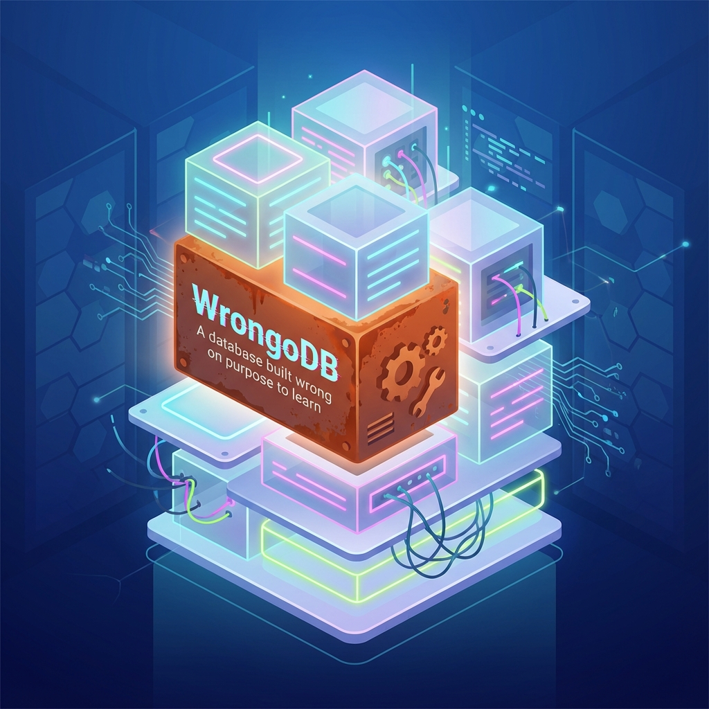
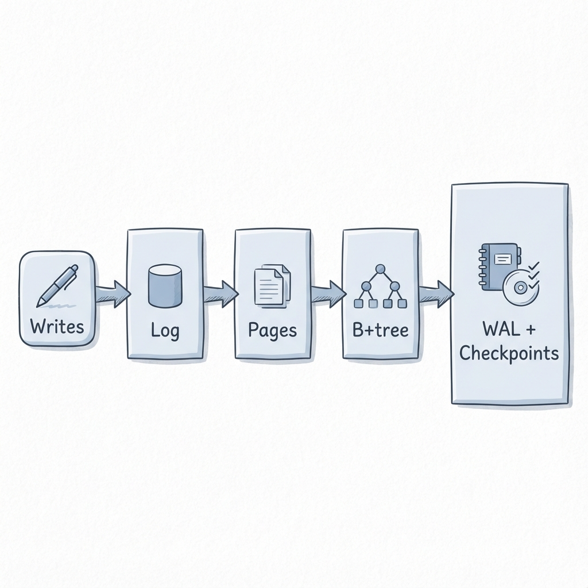

# WrongoDB: a tiny wrong database (on purpose)

So. I’m building a small MongoDB-like store in Rust.

Is it going to replace MongoDB? No.
Is it going to teach me a lot about storage engines? That’s the bet.

The story of the name is a bit different than you might expect. We were actually joking with a colleague at work, but it stuck because it fits perfectly. The goal here is to learn, and there is absolutely no problem with being wrong. In fact, being "wrong" is the point—it means I'm stripping away the production complexity to see the raw moving parts.

This newsletter is my learning journal in code form. It’s intentionally simplified, incomplete, occasionally naive, and very honest about it. The goal isn’t to ship a production database. The goal is to understand the moving parts well enough that I can explain them, refactor them, and eventually build something that *feels* like a tiny, simplified cousin of a real engine.

I am going after **WiredTiger** (the storage engine), and I'm not going to write code by hand. I'm currently using Codex (and other AI tools) to write this.

## Why a MongoDB-like store?

Short answer: No particular reason.

I just needed to start somewhere. Eventually, I'm going to get to "Wrong Kafka" and "Wrong Cassandra". Overall, this is for learning, and given how flexible the document model is, it seems like an interesting place to check out.

It’s also approachable. You think in documents. You think in CRUD. You can sketch an API in five minutes. That’s a nice on-ramp before hitting the hard stuff.

## The Plan: Storage, the hard way (but small)

WrongoDB starts with "store documents somewhere." Then it progresses, one thin slice at a time, toward something that looks like:

- A **log-ish** view of writes (append is easy, right?),
- **Pages** as a unit of IO,
- A **B+tree** implementation,
- And finally: **WAL (Write Ahead Log) + checkpoints**.

Here’s the rough mental model I’m carrying right now. That diagram is deliberately “too neat”. Real designs loop back. They have background work. They have compaction, reconciliation, eviction, and all the machinery you only notice once you’re in trouble. But as a learning scaffold? It’s perfect.

We need to get to the point where we have this structure with the WAL and the B-tree properly responding to the "storage engine questions":

- How do I store documents on disk without making a mess?
- What happens when updates are smaller than a page? Bigger than a page?
- How do I index keys efficiently?
- What does “durable” even mean if I crash mid-write?

When I say "WiredTiger-inspired", I don't mean a clone. I mean stealing the right questions: page-oriented storage, B+tree organization, and separating "how you change data" from "how you read data".

## Learning-first rules

I’m optimizing for understanding. That changes the trade-offs.

- I’ll pick a clean design over a fast design.
- I’ll pick an explicit invariant over a clever trick.
- I’ll accept “toy” constraints if they keep the next concept teachable.

The best sign that this is working is when I can answer: “why is it built like this?” without hand-waving. If I can’t, it means I moved too fast.

So expect refactors. Expect dead ends. Expect me to rename things once I finally understand what they are.

## How AI-driven development fits in here

This project is also a sandbox for **AI-assisted development**. Not "autopilot," but a very patient pair programmer.

The workflow that seems to work for me looks like this:

1.  **Thin slice first.** Pick the smallest feature that changes behavior in a visible way.
2.  **Ask naive questions.** “If I had pages, what’s the minimum metadata I need?”
3.  **Let the assistant propose options.** I want trade-offs, not commandments.
4.  **I choose and implement.**
5.  **I verify with tests.**

It’s great at sketching a design space and pointing out foot-guns. It’s also great at being wrong with confidence. So I treat it like a collaborator.

## What’s in scope (and what isn’t)

**In scope:**
- A minimal document/record model.
- Basic CRUD semantics.
- A storage layer that becomes progressively more realistic.
- The data-structure work (B+tree, pages, free lists, etc.).
- Crash-safety ideas (WAL, checkpoints).

**Out of scope (for now):**
- Distributed anything.
- Complex query planning.
- Full MongoDB compatibility.
- “It must be faster than X” benchmarks.
- Rock-solid durability guarantees from day one.

If you want a production database, you already know where to look. If you want to watch one being *understood*, built, broken, and rebuilt in public… that’s what this is.

## What’s next

Near-term, the direction is:

- Nail down a clear on-disk layout story.
- Build a small B+tree.
- Make writes less magical: introduce an explicit WAL.
- Add checkpoints.
- Start measuring basic counters.

Ok, enough meta. Let’s go build something wrong until it becomes less wrong.
