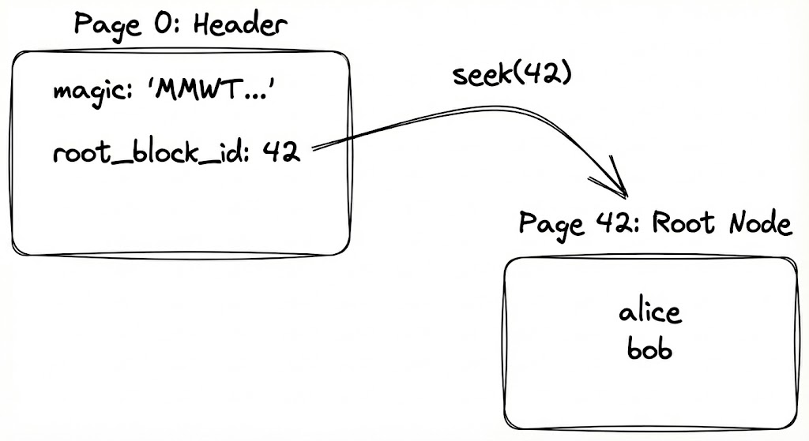
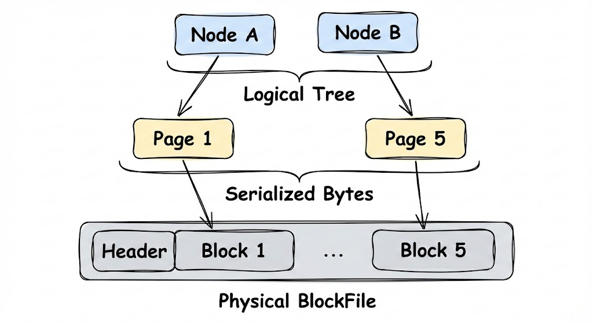

# From Concepts to Bytes: The BlockFile

To build a database, we need two fundamental operations: `get` and `put`.
One of the standard data structures for this is the **B+Tree**.

But a B+Tree is a logical structure made of nodes and pointers. Your hard drive doesn't know what a "node" is; it only knows about files and bytes.

We need a way to map our tree onto the disk. This is the hierarchy of a storage engine:

1.  **Nodes:** The logical parts of the tree (Root, Internal, Leaf).
2.  **Pages:** The fixed-size byte arrays (e.g., 4KB) that serialize a node.
3.  **Blocks:** The physical sections in a file where pages live.





This post is about the **BlockFile**: the machinery that gives our B+Tree a physical place to live.

## The BlockFile mental model

The goal is to treat a file like an array of 4KB pages. Page `0` is the header, and pages `1..N` are the payload.


ASCII time:

```
========================== one file ==========================+
| page 0 (header) | page 1 | page 2 | page 3 | ... | page N   |
+-----------------+--------+--------+--------+-----+----------+
```

Each page (including the header) starts with a 4-byte CRC32 checksum. This is the first time the project stops being "JSON in a file" and starts being "storage."

## Why `seek()` is the foundation

The entire design rests on a simple calculation: `file.seek(block_id * page_size)`.

If you’ve never built a page-based file before, this feels like cheating. You aren't scanning; you're jumping directly to a physical offset. This jump is what makes random access by `block_id` O(1), and it's what allows a B+tree node to point to its children using simple 64-bit integers.

## The key design decision: explicit allocation

In the initial log version, "allocation" was just `write()`. In the BlockFile, I made a strict rule: `write_block(id, payload)` must **not** implicitly allocate.

If you want a new block, you call `allocate_block()`. It either:
1. Reuses a block from the **Free List** (stored in the header).
2. Appends a new block to the end of the file.

This creates a clean boundary between the "Block Manager" and the "B+tree." The B+tree doesn't care *where* the bytes live, only that it has a valid `block_id`.

## Checksums: admitting disks can lie

The moment you start manually seeking and writing bytes, you lose the safety of high-level formats. Partial writes, torn pages, or simple bit flips can corrupt the data.

To detect this, I added a **checksum** to every page. Think of it as a "digital fingerprint": when you write a page, you run a math function over the bytes and store the result (a 4-byte number). When you read the page later, you run the same math. If the numbers don't match, something changed behind your back.

Specifically, I’m using **CRC32 (Cyclic Redundancy Check)**. 
- **Cyclic**: It treats the data as a circular sequence of bits.
- **Redundancy**: It adds extra data (the 32-bit result) that is redundant but allows for checking.
- **Check**: Well, it checks if the data is correct.

It’s a cheap "alarm" that ensures the page you read is exactly what you wrote. If the checksum fails, the database refuses to start. It changes debugging from "why is this JSON weird?" to "the storage layer detected corruption."

## Page 0: The Anchor

If every page looks the same, how do you find the root of the B+Tree?

You can't just pick a random block. You need a stable entry point. That’s **Page 0**.

Page 0 is never used for data. It’s reserved exclusively for the **File Header**. This header contains the metadata required to interpret the rest of the file, most importantly the `root_block_id`.

When the database starts:
1. It reads Page 0.
2. It deserializes the header.
3. It finds `root_block_id`.
4. It loads that block as the root of the B+Tree.

```text
[ Page 0: Header ]                         [ Page 42: Root Node ]
+---------------------+                    +--------------------+
| magic: "MMWT..."    |      seek(42)      | [ "alice" ]        |
| root_block_id: 42   | -----------------> | [ "bob"   ]        |
+---------------------+                    +--------------------+
```

Here is what the header structure looks like in Rust (from [`src/blockfile.rs`](https://github.com/gabrielelanaro/wrongodb/blob/main/src/blockfile.rs)):

```rust
#[derive(Debug, Clone, PartialEq, Eq)]
pub struct FileHeader {
    pub magic: [u8; 8],            // "MMWT0001" - Magic bytes to identify the file format
    pub version: u16,              // Version control for future upgrades
    pub page_size: u32,            // e.g., 4096
    pub free_list_head: u64,       // Pointer to the first free block
    pub checkpoint_slots: [CheckpointSlot; 2], // Two slots for atomic root updates (more on this in future posts)
}
```

This struct is packed into the first 4KB of the file. Without this anchor, the file is just a soup of disconnected 4KB blocks.

## The Payload Pages (1..N)

If Page 0 is the map, then pages 1 through N are the territory.

Crucially, the **BlockFile doesn't know what’s inside them**.

To the storage engine, page 42 is just a bag of bytes. It might contain:

```text
[ Page 42: Raw Bytes (BlockFile View) ]    [ Page 42: Leaf Node (B+Tree View) ]
+-----------------------------------+      +----------------------------------+
| CRC32: 0xA1B2C3D4                 |      | Header: Leaf, 2 records          |
| Payload: [ 00, 01, 4A, ... ]      | ---> | Record 1: { "id": 1, "a": 1 }    |
| (4092 bytes of mystery data)      |      | Record 2: { "id": 5, "b": 2 }    |
+-----------------------------------+      +----------------------------------+
```

- A B+Tree **Leaf Node** (with actual user data).
- A B+Tree **Internal Node** (with pointers to other nodes).
- A **Free List** node (tracking empty space).

This separation is vital. The BlockFile is responsible for "persistence and integrity" (writing bytes safely), while the B+Tree layer is responsible for "structure" (interpreting those bytes).

The API reflects this. `read_block` doesn't return a `Node`; it returns a `Vec<u8>`.

```rust
// From src/blockfile.rs
pub fn read_block(&mut self, block_id: u64, verify: bool) -> Result<Vec<u8>, WrongoDBError> {
    // 1. Calculate offset
    let offset = block_id * self.page_size;
    self.file.seek(SeekFrom::Start(offset))?;

    // 2. Read raw bytes
    let mut page = vec![0u8; self.page_size];
    self.file.read_exact(&mut page)?;

    // 3. Verify Checksum (CRC32)
    // ...

    // 4. Return payload (minus checksum)
    Ok(payload.to_vec())
}
```

It is up to the caller (the `BTree` code) to take these raw bytes and turn them into something useful, like a list of documents.

## Page size: 4KB by default

I picked 4KB because it aligns with common OS and filesystem page sizes

## The artifacts that keep me honest

The "why" behind this layout isn't just in the code; it's in two files that have become my project's brain:

- `PLAN.md`: Tracking the slices (we are currently transitioning from Slice A/B to Slice C).
- `docs/decisions.md`: Documenting why `page 0` is special and how the free list is structured.

Writing these down prevents "future me" from second-guessing why I didn't just use an append-only log forever.


