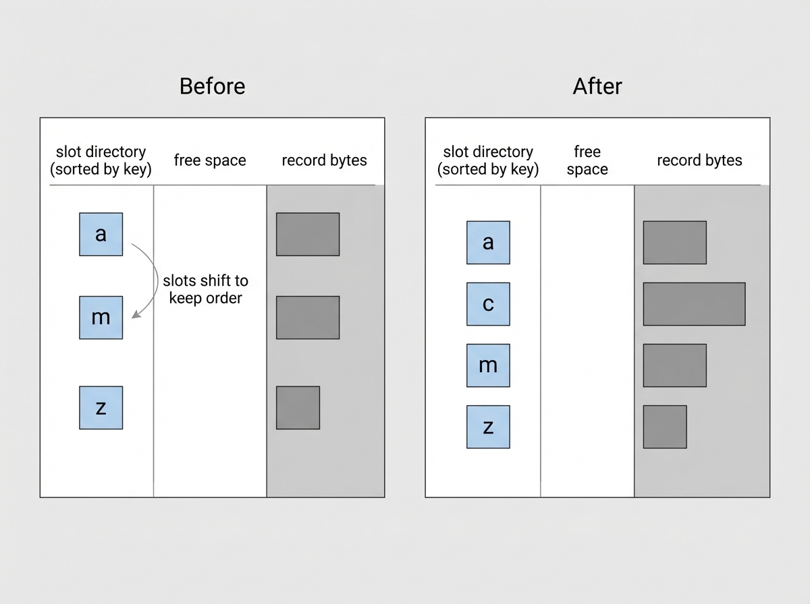
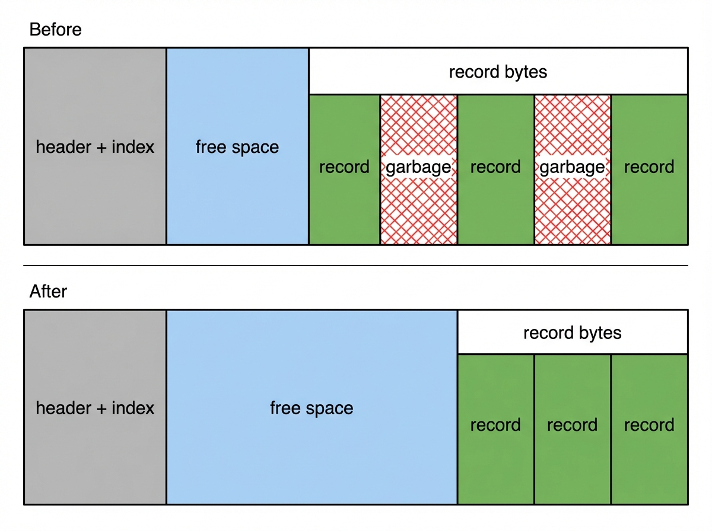

# Slots are not scary

## How a page stores variable-size records without chaos

At some point I literally asked:

> what the hell is a slot

Here is the answer I wish I had then:

A slotted page is a fixed-size page where **record bytes live at the back** and a **tiny index lives at the front**. The index stores where each record starts and how long it is, so records can move without changing their ID. That tiny index entry is what I call a *slot*.


This post is the smallest version of that idea. It is not a B+tree yet. It is the in-page layout that makes a B+tree possible.

## Why this exists (the real problem)

Databases store data in fixed-size pages because disks and caches move data in pages. But our records are not fixed-size. Documents are definitely not fixed-size.

So the real problem is: **how do you fit variable-sized records into a fixed-size page and still support search, inserts, and deletes?**

You need three things at once:

- Insert without shifting half the page.
- Delete without leaving the page unusable.
- Keep keys in sorted order so you can search.

A slotted page is the boring, reliable answer to that.

## The mental model (draw it, always)

You split the page into three regions:

- a small header + index of record locations at the front (slot directory)
- record bytes packed from the back
- free space in the middle

Yes. Slots grow forward from the front. Record bytes grow backward from the end. The free space is the gap between them.

## The tiny header (what those fields are for)

```text
Header (fixed bytes):
- page_type (u8)
- slot_count (u16)
- lower (u16) = end of slot directory
- upper (u16) = start of record bytes
```

Why header size != buffer size when there are no slots?

- The header is fixed and small. The buffer is the whole page (e.g., 4096 bytes).
- `lower` starts right after the header, `upper` starts at the end of the page.

`lower` and `upper` are the page’s free-space accounting. They let us answer two questions fast:

- “Do we have room for this insert?”
- “Where should the next record bytes go?”

## The key decision: slots are sorted, records are not

The thing that makes this work is: **slots stay sorted by key**, even if record bytes do not.

That one rule lets you:

- binary-search slots (fast lookup)
- insert by shifting small slot entries (cheap)
- avoid moving big record bytes around (also cheap)

The bytes can be messy. The slots are the truth.

## A concrete record format (small enough to fit in your head)

Inside the record bytes, I use a simple encoding:

```text
record:
  klen (u16)
  vlen (u16)
  key bytes (klen)
  value bytes (vlen)
```

The record header is 4 bytes: klen (2) + vlen (2). So when I say “key starts at offset +4”, that is why.

## The “oh” moment: insert without rewriting the world

Say the page has three keys:

- `a -> ...`
- `m -> ...`
- `z -> ...`

Now insert `c -> ...`.

With a flat array you would shift every record after `a`. With slots:



- append the new record bytes near the end (move `upper` down)
- insert one slot in sorted order (shift slots, not records)

We still shift things, but we shift *slots*, not record bytes. A slot is 4 bytes. A record might be hundreds of bytes. Shifting the small thing is the whole point.

## Deletes and compaction (the part nobody loves)

Deletes are a two-step story:

1. Remove the slot entry.
2. Leave the old record bytes where they are.

That means the page accumulates garbage. Eventually, you need compaction:

- rebuild the page with only live records
- rewrite slot offsets to point to the new locations



We compact *only when we need space* and a delete left garbage behind. If a new insert doesn’t fit, we compact and try again. If it still doesn’t fit, we return `PageFull`.

It is not glamorous, but it is the first time the system starts acting like a storage engine: validate, rewrite, and preserve invariants.

## PageFull is a feature, not a bug

A page that cannot fit the next record is not a failure. It is a boundary.

It tells you: “this page is full, time to split and build a tree.”

That is the handoff to the next post.

## Why it matters

A slotted page is a **local index**. It is the smallest piece of a real database:

- it supports variable-size records
- it keeps keys ordered
- it has a clear full/empty boundary

Once that exists, a B+tree is “just” a way to connect many pages together.

## What’s next

- B+tree, for real this time
