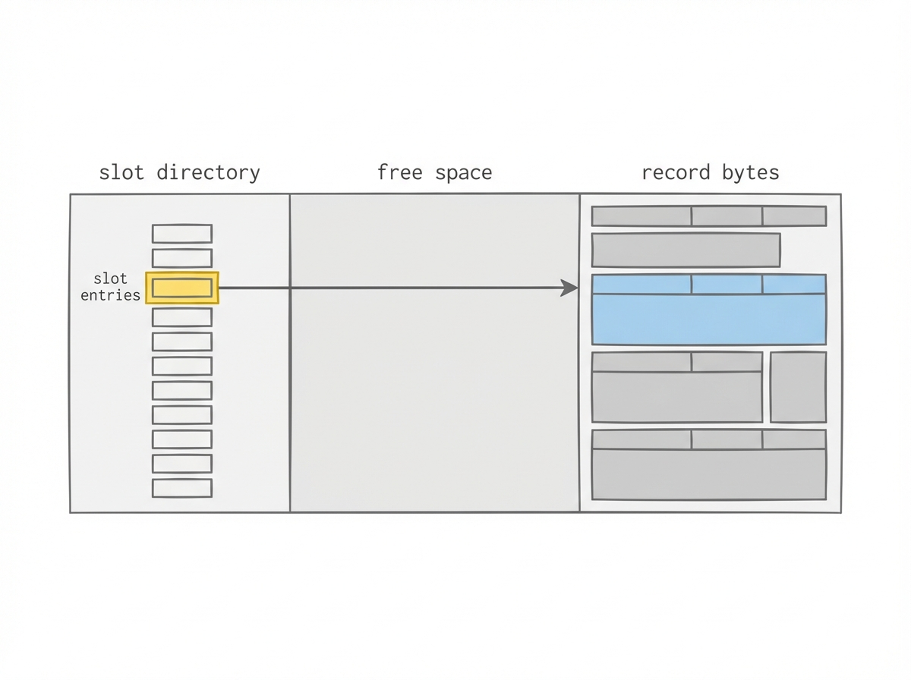

# What the hell is a slot? Slotted pages, deletes, and the first real data structure

At some point I literally asked:

> what the hell is a slot

Which is funny, because the answer is: a slot is just… a tiny pointer.

But slotted pages are one of those ideas that don’t click until you see them drawn and then implemented once.

This post is about the slotted page layout I’m using for a “leaf page” key/value store: the thing that turns “I have pages” into “I can store variable-sized records and delete them without rewriting the world”.

## The problem: variable-sized records on a fixed-sized page

If keys and values were fixed size, life would be easy:

- record `i` starts at offset `i * RECORD_SIZE`
- done

But keys and values are not fixed. Documents are definitely not fixed.

So you need a layout that supports:

- inserts that don’t rewrite half the page
- deletes that don’t require shifting all bytes
- an ordering by key so you can binary search

Enter: the slotted page.

## The slotted page layout (draw it, always)

The mental model:

- the **slot directory** grows from the front
- the **record bytes** grow from the back
- free space is the middle



```
byte offsets: 0                                                 page_end
             +------------------+-------------------+------------------+
             | header + slots   |   free space      |  record bytes    |
             +------------------+-------------------+------------------+
                                 ^                 ^
                               lower              upper
```

Each slot is tiny. Conceptually it’s:

- `offset` (where the record lives)
- `len` (how many bytes it occupies)

That’s it.

The “index” for the page is the slot array, and you can keep it **sorted by key**. That’s the trick: shifting 4-byte slots is cheap compared to moving whole records.

## A concrete record format (small enough to fit in your head)

Inside the record bytes, I use a simple encoding:

```
record:
  klen (u16)
  vlen (u16)
  key bytes (klen)
  value bytes (vlen)
```

So the “header” inside a record is 4 bytes, then the bytes.

This is enough to parse a record given a slot `(off, len)` and to extract the key without knowing anything else.

## The “why does this help?” moment

Let’s say the page currently has three keys:

- `a -> ...`
- `m -> ...`
- `z -> ...`

Now I insert `c -> ...`.

If I stored records in a flat array, I’d have to shift everything after `a` to make room.

With slots:

- I append the new record bytes near the end (moving `upper` down)
- I insert one slot in sorted position (shifting *slots*, not record bytes)

The record bytes don’t have to stay in key order. The *slots* define the order.

That is the “oh” moment.

## Deletes and why compaction exists

Now delete `m`.

What do I do?

The simplest approach (and the one I used in this thin slice) is:

- remove the slot entry for `m`
- leave the record bytes where they are

That means the page accumulates “dead” record bytes over time.

So we need compaction: rebuild the page by copying only live records into a new packed layout, updating slot offsets along the way.

Compaction is not glamorous. But it’s the first time the code starts to feel like storage-engine code:

- validate invariants
- rewrite bytes
- update pointers
- return `PageFull` when you can’t make it work

## `PageFull` is a feature, not an error

When a page is full, two things are true:

- I can’t fit this record in this page.
- I now have a reason to implement the next slice.

In other words, `PageFull` is the hand-off between:

- “single page KV store”
- “B+tree node that can split”

If you don’t have a hard “page full” boundary, you end up doing ad-hoc growth and it gets messy fast.

## Tiny snippet: the header fields that make the whole thing work

I’m not going to paste the full implementation here, but the key header fields are small:

```rust
// conceptual (not exact code)
page_type:  u8
slot_count: u16
lower:      u16 // end of slot directory
upper:      u16 // start of packed record bytes
```

That’s the whole free-space accounting model.

Once you have those, every other operation becomes “adjust lower/upper, validate, maybe compact”.

## The thing I learned: slots are the per-page index

I kept thinking of slots as an annoying indirection.

But it’s better to think of them as: “a tiny, local index inside the page”.

If the slots are sorted by key, you can:

- binary search within the page
- implement range scans later (iterate slots in order)
- split by slot index (not by physical byte region)

It’s a small idea with a lot of leverage.

## Editing notes

- Add a worked example with actual byte offsets (one page, 3 inserts, 1 delete).
- Decide whether to include a compact() pseudocode block (it’s a nice story).
- Mention how this relates to “real” systems (Postgres/SQLite style slotted pages) without turning it into a survey.
- Add one paragraph on fragmentation and why it shows up immediately when you support deletes.

