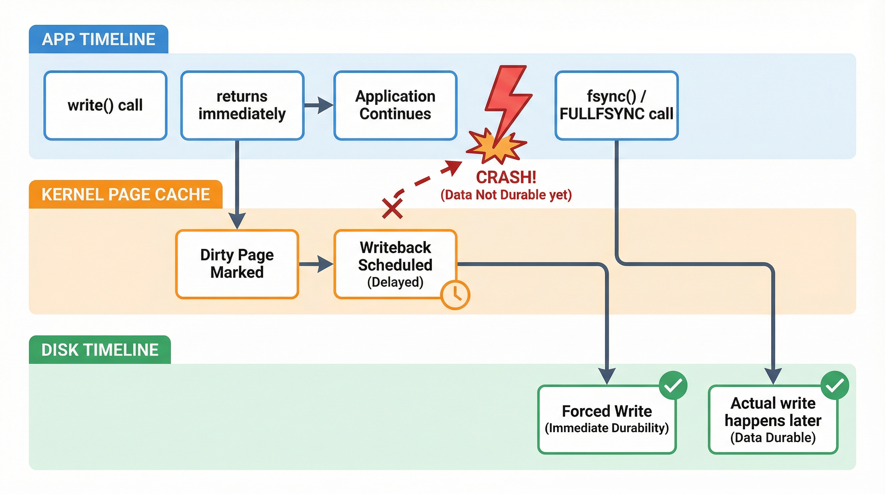
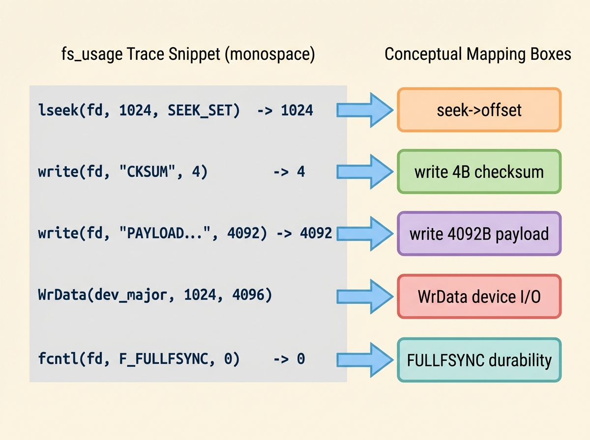

# Watching the OS Write

## The question

I always wondered: when does the OS actually write my files to disk, and can I prove it?

So I asked Codex how to diagnose it. I had a hunch this would matter later, when I start chasing performance issues and have no idea whether I'm blocked on CPU, cache, or the drive.

The answer was not "trust the API." It was: trace the syscalls, then map them back to a mental model. That was the moment I decided: ok, the API exists, but what actually happens?

After BlockFile, that question got teeth. The next real question was not "can I write bytes?" It was "when are those bytes actually safe if the laptop faceplants?"

Recap: the previous post is a quick tour of the BlockFile and why I started caring about durability. If you want that context, it lives here: https://teamkitchen.substack.com/p/from-concepts-to-bytes-the-blockfile?utm_source=activity_item

## The model

Here is the model that finally made the noise make sense, once I pinned down the terms.

When you call `write()`, the OS copies your bytes into the **page cache** (memory pages/chunks the kernel uses to cache file data). That cached page is now **dirty**, which just means “newer than what is on disk.” The syscall returns because the OS accepted the bytes, not because the disk did anything.

Later, the kernel decides to flush dirty pages to storage. That process is **writeback**. Those are the device writes you eventually see as `WrData` in a trace.

If you need a hard durability point, you call `fsync`/`FULLFSYNC`. That forces the kernel to push prior dirty data to stable storage before returning. That is the durable boundary.

```text
Userspace
  write() -> copies bytes into page cache (dirty)
  flush() -> pushes to kernel buffers (still not durable)

Kernel
  writeback -> schedules dirty pages
  device I/O -> actual disk writes

Durable boundary
  fsync/FULLFSYNC -> "safe after crash" point
```

This is the same model as a picture, so you can keep the layers straight in your head:



Keep the two words separate: "written" means the kernel accepted my bytes. "durable" means they will survive a crash. Those are different events separated by time, queues, and sometimes wishful thinking.

## The trace

My strategy was to trace one tiny, repeatable workload and map each line back to the model. I kept it small on purpose: a single BlockFile page write, with optional per-write sync.

`fs_usage` is a macOS tracer that shows live filesystem and disk activity. It lets you see syscalls like `lseek`/`write` and, with different filters, the actual device I/O or cache hints. The setup was simple: run `sudo fs_usage -w -f filesys -t 10 blockfile_workload` in one terminal, and run the workload in another. We stuck to `filesys` for syscall-level visibility; the other useful filters I did not use here are `diskio` (device I/O), `cachehit` (cache activity hints), and `pathname` (path-level churn).

Here is the kind of trace that finally clicked for me:

```
09:13:59.799895  lseek             F=3  O=0x20c42000  <SEEK_SET>  0.000001  blockfile_workload.9941451
09:13:59.799924  write             F=3  B=0x4                    0.000029  blockfile_workload.9941451
09:13:59.799928  write             F=3  B=0xffc                  0.000004  blockfile_workload.9941451
09:13:59.800646  WrData[A]          D=0x015b2c68  B=0x2000  /dev/disk3s5  .../block.bin  0.000029  W blockfile_workload.9941451
09:13:59.804842  fcntl             F=3  <FULLFSYNC>              0.004914  blockfile_workload.9941451
```

I remember asking very dumb questions out loud: what is `B`? why does it say `F=3`? what is `0.000001` and why do I care? The answers are boring and extremely helpful.

- `lseek` moves the file cursor. `F=3` is the file descriptor (my `block.bin`). `O=0x20c42000` is the byte offset. `<SEEK_SET>` means "absolute from file start". The `0.000001` is the time spent in the call, in seconds. **Lightbulb**: the offset ends in `000` because my page size is 4096 (`0x1000`) — every page boundary is a clean hex multiple.
- The `blockfile_workload.9941451` tail is the process name and PID. It looks noisy until you remember you might have multiple processes doing I/O at once.
- The two `write` lines are one logical page write. `B=0x4` is 4 bytes (the checksum). `B=0xffc` is 4092 bytes (the payload). Together: 4096 bytes.
- `WrData[A]` is a real device write. `B=0x2000` is 8KiB, which is bigger than my 4KiB page. The filesystem is allowed to merge and coalesce dirty pages into larger I/Os. That is why you can see multiple `WrData` lines per one logical page update.
- `FULLFSYNC` is the durability boundary. This is where the OS is told to push prior dirty data all the way to stable storage. This is the moment that makes a crash story boring. It is also the slow part.

That one block of output turned into an actual story: my code writes 4KiB, the kernel buffers it, the filesystem decides how to flush it, and only a sync call draws the line that says "this is safe now".



The other weird thing I noticed is that trace lines are not always ordered the way your brain wants. Sometimes the `FULLFSYNC` line looks like it arrives before the writes. The actual reason is simpler: I was running this in a loop, so the sync you see belongs to the previous write and the next write is already queued. Facepalm.

## The takeaway

Once I had the trace, I realized I was mixing these up. This whole exercise taught me to separate three timelines:

1. what my code asked for
2. what the kernel accepted
3. what the disk actually persisted

That separation is the durability story.


## What’s next
- B+trees?
- Writing real data into the BlockFile?
- We’ll see.
