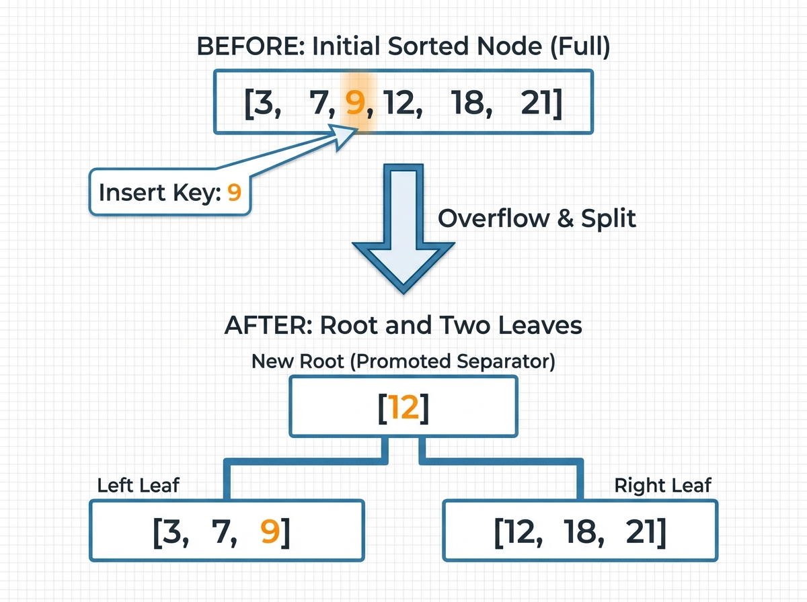
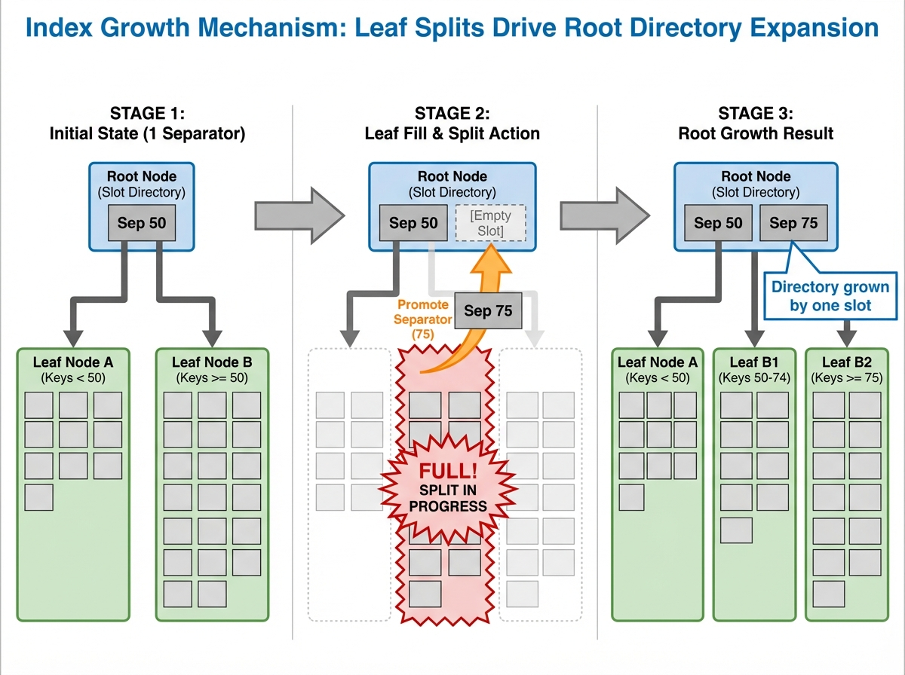

# From one page to a B+Tree (Part 1)

## Page-shaped divide and conquer

Enough scans, enough hand-waving. B+trees, finally.

Last time I built a single-page key/value store with slots and compaction. It's only 4KB, what do we do now? How do we start splitting and combining those pages? Both the data and the index should be on-disk.

We need to have a **page-shaped divide and conquer**. Every time a page fills up, we split it into two sorted halves and we save the "separator" key (the first key in the right half) in another page, which we call the "internal routing page".

In other words: A B+tree. In this post we introduce how we go from one page to a two-level B+tree. In the next post we'll add multi-level to the mix based on this foundation.

## Why B+trees exist at all

If you build a database, you need lookups that stay fast even when the file is big. You want the cost to be predictable when the file is 50x larger, and on disk.

Storage gives you **pages**, so the real cost is "how many pages do I read?" A B+tree makes that cost small and stable by turning each split into a routing entry:

- When a page fills, you split it into two sorted halves.
- You keep one separator key (the first key in the right half).
- That separator becomes a routing entry in another internal page.
- Every internal page is a divide-and-conquer step over *pages*, not over individual records.

B+trees are the boring, reliable workhorse for on-disk data because they match how storage actually works:

- Disk and OS caches move data in pages, so the tree stores one page per node.
- Each page can hold many keys, so the tree has few levels (wide and short).
- A wide, short tree means only a few page reads per lookup.
- Keys stay sorted, so ranges are natural (later).
- Inserts do not break the structure; they split pages and keep the tree balanced.


## The smallest useful tree

I am not building the full thing yet. The thin slice here is a two-level tree:

- **leaf pages** hold the actual key/value records
- **one internal page** holds a few separator keys and child pointers

The key decision is the separator rule: **the separator key is the first key in the right leaf.** That single choice gives a stable routing rule:

- If key < separator, go left.
- If key >= separator, go right.

So the internal page can use an upper-bound search, and the tree stays correct no matter how many inserts come later.


## The split sequence (the moment the tree is born)

The split starts the second a leaf says “PageFull”. I rebuild the page into two leaves and then create a tiny root to point at them. At a high level the sequence is:

1. Read the leaf entries and insert the new key into that sorted list.
2. Split the list into left and right halves.
3. Pick the divider key: the first key in the right half.
4. Write two leaf pages (left and right) to disk.
5. Create a new root internal page that points at them.

Here is a tiny example with six keys:

- existing keys: 3, 7, 12, 18, 21
- insert: 9
- sorted list: 3, 7, 9, 12, 18, 21
- split: left = 3, 7, 9 | right = 12, 18, 21
- separator = 12 (first key in the right half)

Pseudocode, not exact code:

```text
entries = read_leaf()
entries.insert(new_kv)
left, right = split(entries)
sep = first_key(right)
left_id  = write_page(left)
right_id = write_page(right)
root = new_internal(first_child=left_id)
root.put_separator(sep, right_id)
set_root(root)
```

That is the smallest B+tree. Two leaves and a tiny root with one separator key.



## How internal pages fill up

Internal pages fill up the same way leaves do: **every time a child splits, you insert a new separator key into the parent**.

Here’s the shape of that:

1. A leaf splits and produces a separator key.
2. The parent internal page inserts that separator and a pointer to the new right child.
3. The parent’s slots grow, and its free space shrinks.
4. If the parent runs out of space, the parent splits too (not in this post yet).

So the root starts tiny, then accumulates separator keys as more leaf pages split. It is just a compact index of “where the boundaries are” between child pages.



## Show me the code, boi

Two pieces of code matter here:

1) **Internal page layout** (`src/internal_page.rs`)

The internal page has the same slotted layout as a leaf, but the record value is a child pointer instead of a user value. The header includes a `first_child` pointer for keys smaller than the first separator key.

In plain terms, the header is:

```text
page_type  (internal)
slot_count
lower / upper
first_child
```

Each slot stores:

```text
separator_key -> child_pointer
```


2) **Root creation on split** (`src/btree.rs`)

When a leaf split happens at the root, I allocate a new internal page and store a single separator key. That is the moment you "grow" the tree.

## Why this matters

This is the first time the system has **predictable lookup cost**. Even if the data doubles, the lookup path is still just a few page reads. The tree is still short, because each page holds many keys.

It is also the first time the system has a clean growth story. A split does not destroy old data; it creates new pages and rewires the root. That is the exact shape I need for more advanced features later (range scans, checkpoints, and eventually multi-level growth).

This is why B+trees show up in so many databases. They are a clean, boring, scalable answer to “how do I find things on disk?”

## What is next

- Let the tree grow past one root page (full-height splits).
- Add a range scan that walks keys in order.

