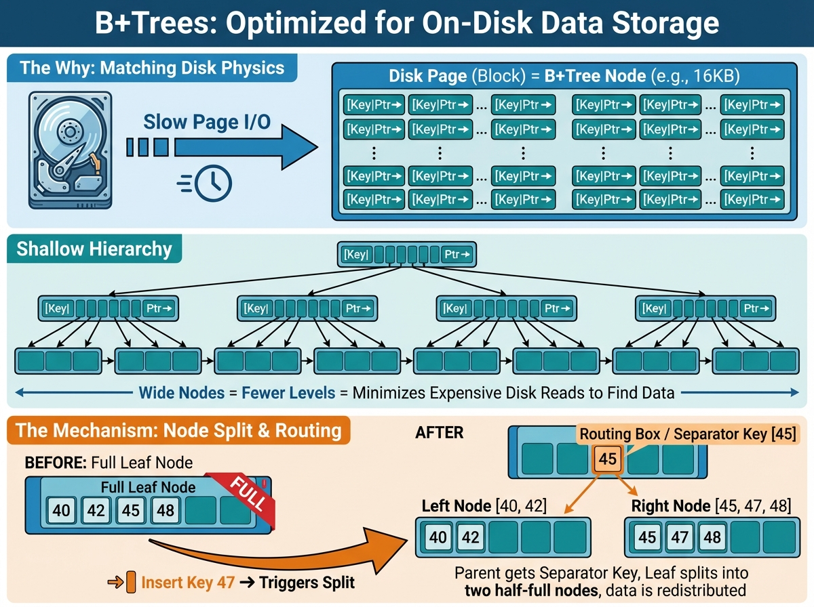
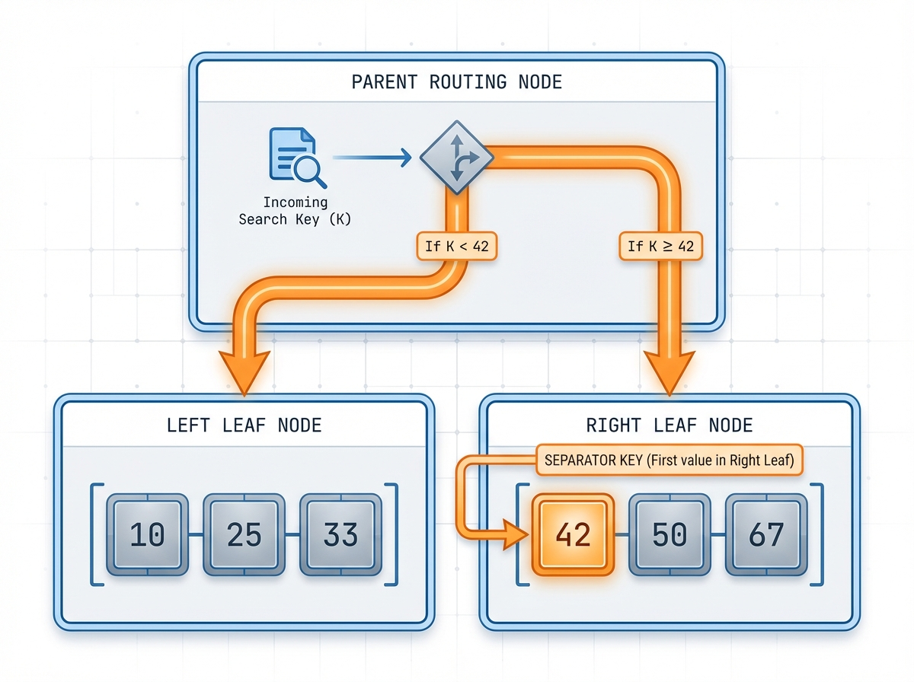

# From one page to a tree

## My first B+tree split

Enough scans, enough hand-waving. B+trees, finally.

Last time I built a single-page key/value store with slots and compaction. It was the first time the bytes felt real. It also ended with a hard boundary: `PageFull`. That boundary is the handoff to a real index.

Here is the one-sentence definition that finally made this click for me:

A B+tree is a sorted collection of fixed-size pages, plus a few tiny index pages that point to the right data page.

That is the whole trick. Pages stay sorted, and a small top page tells you which page to read.

## Why B+trees exist at all (not just because my page filled up)

If you build a database, you need lookups that stay fast even when the data is big. Not "fast on my laptop today", but "predictable when the file is 50x larger". B+trees are the default answer because they match how storage actually works:

- Disk and OS caches move data in pages, so the tree stores one page per node.
- Each page can hold many keys, so the tree is wide and short.
- A wide, short tree means only a few page reads per lookup.
- Keys stay sorted, so ranges are natural (later).
- Inserts do not break the structure; they split pages and keep the tree balanced.

There are other index structures, but B+trees are the boring, reliable workhorse for on-disk data. This post is my smallest slice of that idea.



## The smallest useful tree

I am not building the full thing yet. The thin slice here is a two-level tree:

- **leaf pages** hold the actual key/value records
- **one internal page (the root)** holds a few separator keys and child pointers

No multi-level growth. No range scans. Just enough structure to stop scanning the world.

Conceptually it looks like this:

```text
           [root]
 key < D -> left leaf
 key >=D -> right leaf
```

That is the entire routing rule. The root is just a small routing table.

## The key decision: what is the separator key?

I chose the simplest rule that stays consistent across splits:

**The separator key is the first key in the right leaf.**

That sounds small, but it matters. It gives one clean rule for routing:

- If key < separator, go left.
- If key >= separator, go right.

So the internal page can use an upper-bound search, and the tree stays correct no matter how many inserts come later.



## The split sequence (the moment the tree is born)

The split starts the second a leaf says "PageFull". I rebuild the page into two leaves and then create a tiny root to point at them. At a high level the sequence is:

1. Read the leaf entries and insert the new key into that sorted list.
2. Split the list into left and right halves.
3. Pick the divider key: the first key in the right half.
4. Write two leaf pages (left and right) to disk.
5. Create a new root internal page that points at them.

Pseudocode, not exact code:

```text
entries = read_leaf()
entries.insert(new_kv)
left, right = split(entries)
sep = first_key(right)
left_id  = write_page(left)
right_id = write_page(right)
root = new_internal(first_child=left_id)
root.put_separator(sep, right_id)
set_root(root)
```

That is the smallest B+tree. Two leaves and a tiny root with one separator key.


## Concrete artifact: what I actually built

Two pieces of code matter here:

1) **Internal page layout** (`src/internal_page.rs`)

The internal page has the same slotted layout as a leaf, but the record value is a child pointer instead of a user value. The header includes a `first_child` pointer for keys smaller than the first separator key.

In plain terms, the header is:

```text
page_type  (internal)
slot_count
lower / upper
first_child
```

Each slot stores:

```text
separator_key -> child_pointer
```

2) **Root creation on split** (`src/btree.rs`)

When a leaf split happens at the root, I allocate a new internal page and store a single separator key. That is the moment the tree stops being a single page and becomes a two-level index.

## Why this matters (beyond "I stopped scanning")

This is the first time the system has **predictable lookup cost**. Even if the data doubles, the lookup path is still just a few page reads. The tree is still short, because each page holds many keys.

It is also the first time the system has a clean growth story. A split does not destroy old data; it creates new pages and rewires the root. That is the exact shape I need for more advanced features later (range scans, checkpoints, and eventually multi-level growth).

This is why B+trees show up in so many databases. They are a clean, boring, scalable answer to "how do I find things on disk?"

## What is next

- Let the tree grow past one root page (full-height splits).
- Add a range scan that walks keys in order.
- Wire `_id` lookups to hit this tree instead of scanning.

## Editing notes

- Add a concrete toy example with 6 keys and a split diagram that shows real key values.
- Decide whether to include the one-line `child_for_key` rule from `InternalPage`.
- Generate the three diagrams for the mental model and split sequence.
- Consider a short "why not hash index" paragraph, but only if it stays short.
