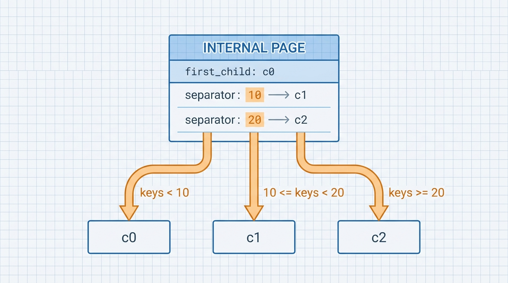

# From two levels to a real B+tree (Part 2)

Last time I stopped at a two-level tree. This quick post finishes the job. Splits propagate upward, internal pages can split, and the root can grow. The tree can grow beyond two levels and still route keys correctly.

## The rule that keeps routing correct

Part 1 ended with a root and a small set of leaf pages. The root was an internal page. It stored separator keys and child pointers. A leaf split produced two leaf pages. I copied one key into the parent. That key came from the split.

Example: the left leaf holds `3, 7, 9`, the right leaf holds `12, 18, 21`, and the parent stores `12`.

That key is a separator. The rule is simple.

**A separator key is the minimum key in the right child.**

Every key in the left child is smaller than `sep`. Every key in the right child is `sep` or larger. An internal page can say:

- If `key < sep`, go left.
- If `key >= sep`, go right.

Here is the routing rule as a picture.



## Split propagation

An insert starts as a write to one leaf page. If the leaf has space, the change stays inside that page. If it overflows, the leaf splits and the split moves upward.

This is the core loop. It shows how a split from a child turns into a new separator in the parent. It also shows how the split can keep moving upward.

```rust
fn insert_into_internal(
    mut node: InternalNode,
    key: &[u8],
    value: &[u8],
) -> (InternalNode, Option<Split>) {
    // Route to the child that should receive this key.
    let i = node.child_index_for_key(key);

    // Recurse into that child.
    let (new_child, child_split) = insert(node.child(i), key, value);

    // Update the parent to point at the updated child subtree.
    node.set_child(i, new_child.id());

    // If the child split, insert the new separator into this internal node.
    if let Some(split) = child_split {
        node.insert_separator(split.sep_key, split.right_child);
    }

    // If this internal node still fits, stop here.
    if node.fits_in_page() {
        return (node, None);
    }

    // Overflow: split this internal node and return a promoted separator upward.
    let (left, promoted_sep, right) = node.split();
    (left, Some(Split { sep_key: promoted_sep, right_child: right.id() }))
}
```

Here is the full process of creating a new root as a sequence of splits.


## Splitting internal pages

An internal split promotes one separator to the parent. The promoted key is removed from both children and becomes the new separator in the parent.

Conceptually:

```text
internal entries: [ (10->c1), (20->c2), (30->c3), (40->c4) ]

promote 30
left  keeps: 10, 20 (first_child stays c0)
right keeps: 40     (first_child becomes c3)
parent inserts: 30 -> right_node
```

The right node's first_child is the promoted key's child. That maintains the separator rule.

## Root growth

If a split reaches the root, create a new root that points at the two children and stores the promoted separator. The tree height increases by one. The same split rule keeps working as the tree grows.

## A tiny walkthrough

Say the root routes between three leaf pages. We insert a key, the target leaf overflows, and returns `sep = 17`.

- Root inserts `17 -> new_right_leaf`.
- Root is now full, so it splits.
- The split promotes a separator up.
- A new root is created.

The same split logic applies at each level. Leaves and internal pages follow the same pattern.

## What I shipped

- Recursive insert that returns `(new_node_id, optional_split)` upward.
- Internal page splits with a promoted separator.
- Root growth when the split reaches the top.

That is enough for the tree to grow arbitrarily and stay balanced.

## What I skipped

- Deletes or merges.
- Leaf sibling links.
- How to handle uplicate keys.
- Range scan.


I'll tackle those another time.