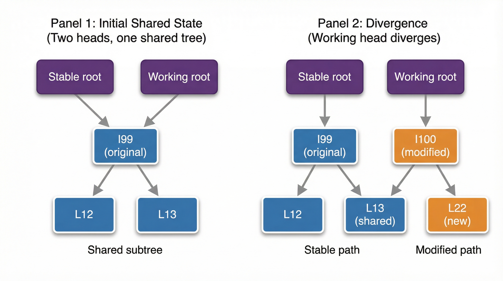
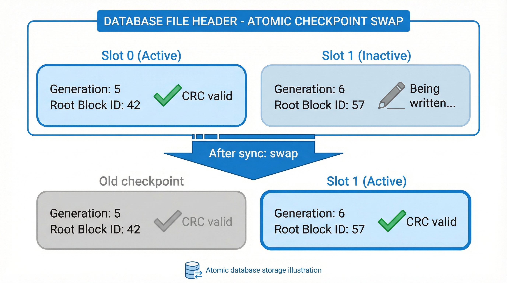
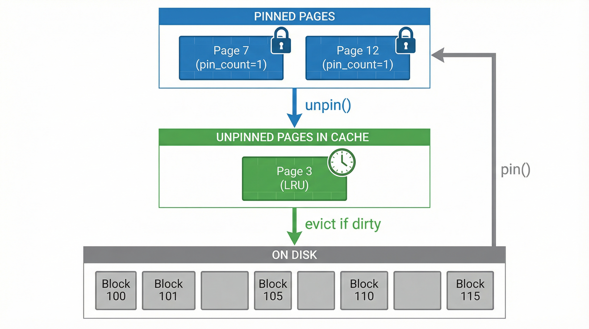

# Making the Tree Crash-Safe

## How can I make closing my laptop safe?

The B+tree works. I can insert keys, they get sorted, pages split when they fill up. Now the fun starts, we need to make this thing resistant to crashes, restarts etc. Let's explore the problem.

When I insert a key that triggers a split, the tree might touch four or five pages: two new leaves, a parent update, maybe a new root. Each page is a separate write to disk. If the program crashes after writing some pages but not others, the file is in an inconsistent state. The root might point to a page that was recycled, or the tree might have orphan pages that nothing references.

What I need is a way to batch changes and write them all-or-nothing, this way I have a consistent picture on disk. That's a checkpoint. And to make checkpoints work without copying the whole database each time, whenever we want to modify a page, we create a copy of it. This is called copy-on-write or COW (muuhhh).

## Two views of the same data

A tree is a collection of nodes and edges (I guess parent-child relationships). Now, if we make two roots point to the same set of leaves (like a hydra, multiple heads, same body), you start to understand that you can replace some pages individually and this way maintain multiple versions.

In the case of WrongoDB, we have two roots:
- **Stable root**: The last checkpoint. Immutable. If you crash, you recover here.
- **Working root**: The current in-progress tree. This is where mutations happen.

When you insert a key, you copy the original page to a new location, modify the copy, and update the working root to point there. The stable tree stays exactly as it was. The working tree accumulates new pages. When you're ready, you atomically swap the root pointer in the file header. That's the checkpoint.



The key invariant: **once a page is part of the stable tree, it never changes**. New writes go to new pages. Old pages are "retired" and can be reclaimed after the next checkpoint.

This is copy-on-write. It lets you treat the stable tree as a snapshot while you build the next one. Really cool concept in my opinion.

## How a write actually works

Here's what happens when I insert a key that fits in an existing leaf:

1. Find the leaf page in the stable tree
2. Allocate a new page for the working copy
3. Copy the stable leaf's data to the working page
4. Insert the new key into the working page
5. Update the parent to point at the working page instead of the stable one
6. Mark the old leaf page as "retired"

Wait—the parent changed too. So we COW the parent as well. If the parent is full, we split it. This bubbles up to the root, potentially growing the tree height.

The stable tree never sees any of this. It's immutable. Only the working tree changes.

```rust
fn insert(tree: &mut BTree, key: &[u8], value: &[u8]) {
    // Start at the working root
    let root_id = tree.working_root;
    
    // Recursively insert, returning the new root if it changed
    let new_root = insert_recursive(root_id, key, value);
    
    // Update working root (not stable yet!)
    tree.working_root = new_root;
}

fn insert_recursive(page_id: u64, key: &[u8], value: &[u8]) -> u64 {
    // COW: read the stable page, write to a new working page
    let stable_page = read_page(page_id);
    let mut working_page = allocate_new_page();
    working_page.copy_from(&stable_page);
    
    // Try to insert into the working page
    match working_page.insert(key, value) {
        Ok(()) => {
            // Fits! Return the working page's ID
            retire_page(page_id);
            working_page.id()
        }
        Err(PageFull) => {
            // Split! Create two new working pages
            let (left, right, separator) = split(working_page);
            let left_id = write_new_page(left);
            let right_id = write_new_page(right);
            retire_page(page_id);
            
            // Return split info to parent
            SplitResult { left_id, right_id, separator }
        }
    }
}
```

Notice: we never write to `page_id` directly. We always write to a new page. The old page stays reachable from the stable root until we checkpoint.

## The checkpoint

A checkpoint is the moment the working tree becomes the stable tree. It's simpler than it sounds:

1. Flush all dirty working pages to disk
2. Sync to ensure writes are durable
3. Atomically write the new root block ID to the file header (with a generation number and CRC)
4. Sync again
5. Reclaim retired blocks (this is unrelated, but worth mentioning there *is* a point where we reclaim some space)

The atomic root swap is the durability boundary. Before step 3, a crash leaves you with the old stable tree—you lose some writes, but the file is consistent. After step 3, a crash leaves you with the new stable tree.

The file header has two checkpoint slots. We alternate between them, writing the new root to the inactive slot, then switching. If a crash happens during the header write, the older slot (with the valid CRC) is used on recovery.



```rust
fn checkpoint(tree: &mut BTree) {
    // Flush dirty pages to their new block locations
    pager.flush_cache()?;
    sync_all()?;
    
    // Atomic root swap: write new checkpoint slot
    let new_root = tree.working_root;
    let new_generation = stable_generation + 1;
    header.write_checkpoint_slot(new_root, new_generation);
    sync_all()?;
    
    // Now safe to reclaim blocks from the old stable tree
    pager.free_retired_blocks()?;
    
    // Working becomes the new stable
    tree.stable_root = new_root;
}
```

## What about reads during writes?

There's a subtle problem. What if I'm iterating through the tree while a checkpoint happens? I'm reading a leaf page, and suddenly the cache evicts it to make room, or the block gets reclaimed after checkpoint.

The answer is **pinning**. Before you use a page, you pin it. The cache guarantees pinned pages won't be evicted. When you're done, you unpin.



For point lookups, you pin, read, unpin immediately. For range scans, you pin the current leaf, advance, pin the next, unpin the previous. The cache uses LRU eviction among **unpinned** pages only.

This adds complexity, but it's necessary. Without pinning, a long-running scan could crash into a page that no longer exists.

## What I skipped

This gives us crash consistency—after a checkpoint, the file is valid. But it's not full durability:

- **WAL (Write-Ahead Logging)**: Writes between checkpoints are lost on crash. A WAL would log every operation and replay on recovery, giving durability without constant checkpointing. That's next.
- **Concurrent transactions**: Everything is single-threaded. MVCC would let readers use the stable snapshot while writers work on the working tree. We might cover it.
