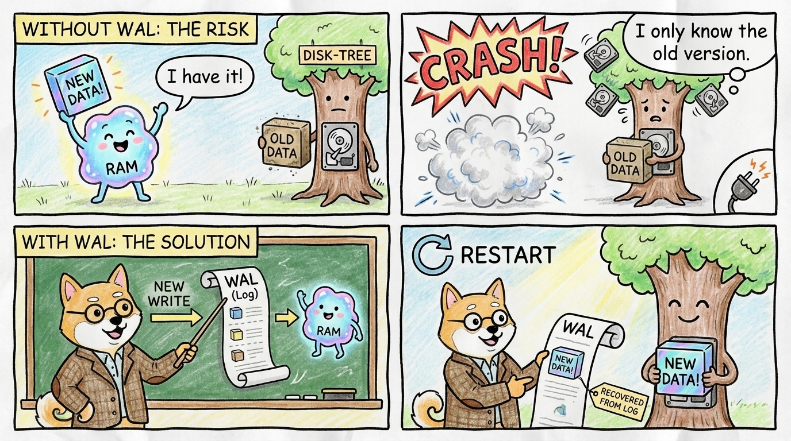
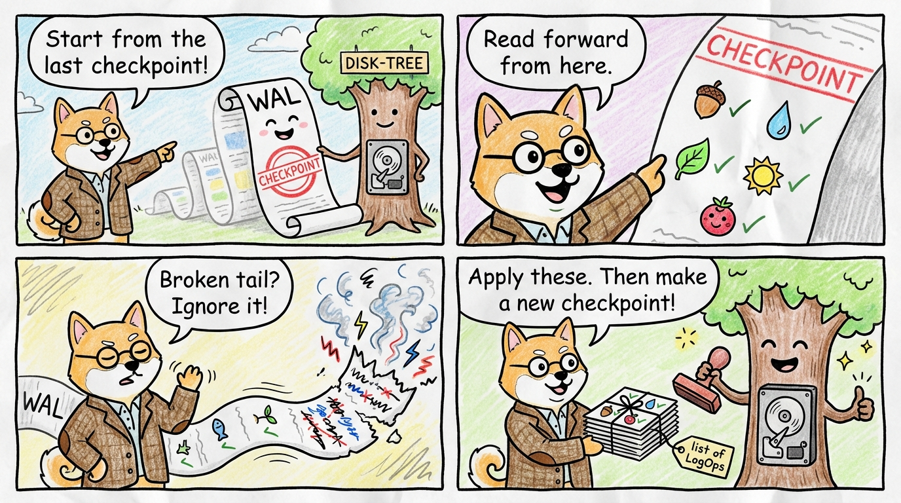

# The Gap Between Checkpoints - Write ahead log

## What problem does a WAL solve?

It took me a while to write this post because I kept getting the WAL design wrong.

Let me start with a small recap.

WrongoDB stores data in a B+tree. A B+Tree is stored on disk in pages, and whenever we do a modification to the tree, the relevant page is coped in memory and put into a cache so that writes are fast. This is called "copy-on-write".

**When a page changes, do not overwrite the old saved page. Write the new data somewhere else, then later switch the tree to point to the new page.**

But when do things get written to disk then? These pages are periodically flushed to disk, along with some metadata. This process is called "checkpoint".

You now understand that since we got stuff going into memory first, if we crash between checkpoints, poof, we are doomed, we lose the data.

That is exactly the problem the WAL solves. So here is the one-sentence definition for this post:

**A write-ahead log is a file where the database stores a write before that write has been fully copied into the main data files.**

And for this post, we have professor shiba inu to tell us how it works.



## Enter the WAL

How does the WAL work then? Before the database says "this write is safe", it first appends an entry to file called `global.wal` and syncs that log file immediately.

So now the write path looks like this:

1. accept a write
2. update the new in-memory version
3. append the write to the WAL
4. sync the WAL
5. later, during a checkpoint, copy those changes into the main data files

The main data files may still be old, but the write is at least safely stored in the WAL. On restart, the database can read the WAL entry and apply that write again.

That is why it is called "write-ahead" logging. The log is written **ahead of** the main data files catching up.

One more term before we continue: `LSN` means "log sequence number". It is just the position of an entry in the WAL.

To keep this post simple, think of the WAL as storing entries like this:

```rust
pub struct WalEntryHeader {
    lsn: u64,
    prev_lsn: u64,
}

pub enum LogOp {
    Put { key: Vec<u8>, value: Vec<u8> },
    Delete { key: Vec<u8> },
}

pub struct WalEntry {
    header: WalEntryHeader,
    ops: Vec<LogOp>,
}
```

- one `LogOp` is one change
- one WAL entry can contain one or more `LogOp`s (think of indexes, or stuff that need to be updated together as a unit, this is why we store multiple in one entry)
- each WAL entry also has a small header with a "log sequence number" or `lsn`, so we can identify each entry in order

## The recovery procedure

Recovery is the process of reading the WAL and applying the changes to the main data files, seems simple at first, but I had spend a ton of time de-slopping this code.

The first question is, ok I got these changes in the wal. Where do I start my replay?

We need somehow to mark a point in the WAL that says:

"Everything before this point is already reflected in the main data files."

The clean way to do this is:

- each WAL entry stores its log sequence number (`lsn`), which tells us its position in the WAL
- when we finish a checkpoint, we record that `lsn` in the checkpoint metadata

So the checkpoint tells us, "the main data files are good up to this WAL position."

After that, recovery is just: start from the last checkpoint LSN, then walk forward through the WAL entry headers until the end.

After a crash, WrongoDB does this:



1. open the database
2. check whether `global.wal` exists
3. open the WAL starting from the LSN stored by the last checkpoint
4. scan forward until the end.
5. read the list of `LogOp`s from each WAL entry
6. apply those `LogOp`s through the normal B+tree write path
7. run a checkpoint so the main data files catch up again

An important detail:

recovery reuses the normal write path instead of inventing a separate recovery-only page format.

But there is one important catch: recovery must not write to the WAL again while it is applying the WAL.

In other words, "same same but different", and this is exactly the sort of rule that can wreck the code as the agent will start to leak abstractions left and right to implement this.

## Wall of wrong

Here's a list of all the things I did wrong while building this.

### Mistake 1: one WAL per tree

You use plan mode, agent asks for a question on how to extend from single tree to multiple trees: maybe each B+tree should have its own log file.

That sounds neat until one user write touches more than one tree. Metadata can change. Secondary indexes can change. One write can affect multiple places.

Now restart has to answer ugly questions:

- which log do I read first?
- how do I know the writes from different logs belong to the same WAL entry?
- what is the single correct recovery order?

That is why WrongoDB moved to one `global.wal` for the whole connection.

One log is easier to reason about than several almost-synchronized logs.

### Mistake 2: What exactly to log in the WAL.

I tried:

- logging page bytes directly: bad idea, how do you deal with split and multi-page changes?
- logging individual `LogOp` like put and deletes: also bad idea as now you have the issue of atomicity, this was extremely important to get transaction work and I went on a massive rabbit hole to be able to grasp it.

Logging a list of `LogOp`s is much cleaner. That is also much closer to how WiredTiger approaches the problem.

### Mistake 3: treating WAL as an isolated feature

This was the biggest one.

I kept thinking, "I just need a log file."

That is not really the problem.

The real questions are:

- when is it safe to say a write is durable?
- what exactly gets written into the log?
- how does restart know what to replay, and in what order?
- how do metadata changes fit into the same model?

Once I started looking at WAL a bit more holistically things finally clicked. How wiredtiger treats transaction (for a future post), was also super important to nail the WAL.

## What’s next

- MVCC and transactions!
