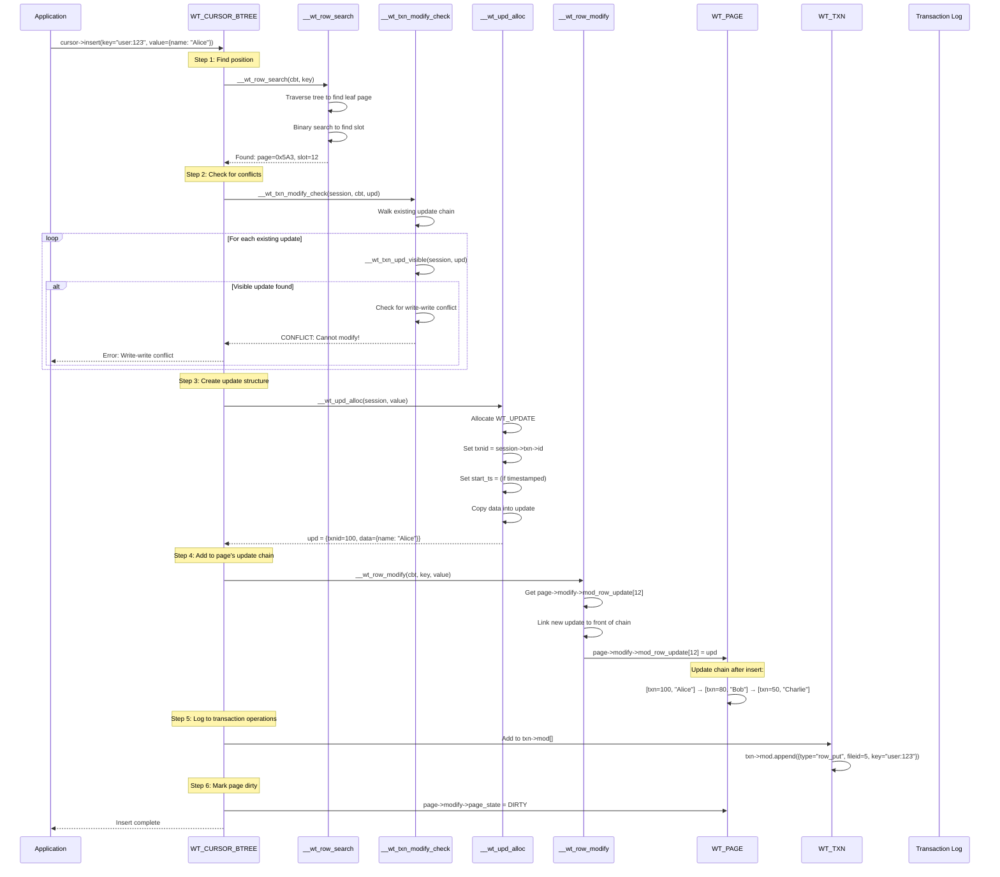

# Cursor Insert: What Happens Under the Hood

## Overview

When you call `cursor->insert(key, value)`, WiredTiger goes through several steps:

1. **Search for the key position** (where does it go?)
2. **Check for conflicts** (can I modify this based on my snapshot?)
3. **Allocate an update structure** (create the in-memory version)
4. **Add to update chain** (link it into the page's modify list)
5. **Log to transaction operations** (for WAL)
6. **Mark page as dirty** (for checkpoint)

## The Complete Flow



## Step-by-Step Breakdown

### Step 1: Find Position (`__wt_row_search`)

```c
// Find WHERE the key goes in the B+tree
__wt_row_search(cbt, key="user:123", ...);

// Result:
cbt->ref = page_ref;      // Page reference
cbt->slot = 12;           // Slot within page
cbt->compare = 0;         // Found exact match (for update)
```

### Step 2: Check for Conflicts (`__wt_txn_modify_check`)

**This is where SNAPSHOT comes in!**

```c
// Check if we can modify based on our snapshot
__wt_txn_modify_check(session, cbt, existing_update, ...);

// For SNAPSHOT ISOLATION, this calls:
__txn_modify_block(session, cbt, existing_update);

// Walk the update chain:
for (WT_UPDATE *upd = existing_update;
     upd != NULL && !__wt_txn_upd_visible(session, upd);
     upd = upd->next) {

    // If update is NOT visible to me AND not aborted:
    if (upd->txnid != WT_TXN_ABORTED) {
        // CONFLICT! Someone else has uncommitted data here
        return WT_ROLLBACK;
    }
}
```

#### Example: Conflict Scenario

```
My transaction: txn_id=100, snapshot={snap_min=50, snap_max=150, snapshot={80}}

I want to insert key="user:123"

Existing update chain:
┌────────────────────────────────────────┐
│ [txn_id=90, value="Bob"]  ← Check visibility │
│ [txn_id=60, value="Alice"]                │
│ [txn_id=40, value="Charlie"]                │
└────────────────────────────────────────┘

Check from newest (90) to oldest:
- txn 90: Is 90 in my snapshot {80}? NO → Is 90 ≥ 150? NO → Check snapshot: INVISIBLE!
- txn 90 is not visible AND not aborted → CONFLICT!

Result: Cannot insert, must rollback or retry
```

### Step 3: Allocate Update (`__wt_upd_alloc`)

```c
// Create the in-memory update structure
WT_UPDATE *upd;
__wt_upd_alloc(session, value={name: "Alice"}, modify_type=WT_UPDATE_STANDARD, &upd);

// The update is tagged with my transaction:
upd->txnid = session->txn->id;           // e.g., 100
upd->start_ts = session->txn->commit_ts;  // e.g., 1234567890
upd->durable_ts = 0;                       // Not yet durable
upd->type = WT_UPDATE_STANDARD;             // Regular value
upd->data = copy_of(value);                // Copy the data
upd->size = value.size;
upd->next = NULL;                           // Will be linked
```

### Step 4: Add to Page's Update Chain (`__wt_row_modify`)

```c
// Get the update list for this slot
WT_UPDATE **upd_entry = &page->modify->mod_row_update[slot];

// Link our new update to the FRONT (newest)
upd->next = *upd_entry;        // Point to old updates
*upd_entry = upd;              // Replace head with our update

// Result: New update chain
// [txn=100, "Alice"] → [txn=80, "Bob"] → [txn=50, "Charlie"]
```

### Step 5: Log to Transaction Operations

```c
// Add this operation to the transaction's log
WT_TXN_OP *op;
op->type = WT_TXN_OP_BASIC_ROW;
op->btree = btree;
op->op_row.key = copy_of(key);
op->op_row.upd = upd;           // Point to our update
op->op_row.upd = copy_of_value;

// Append to transaction's operation list
txn->mod[txn->mod_count++] = op;
```

This will be written to the WAL during commit!

### Step 6: Mark Page Dirty

```c
// Mark page as modified (for checkpoint/eviction)
page->modify->page_state = WT_PAGE_DIRTY_FIRST;

// Update transaction state
txn->mod->bytes_dirty += update_size;
```

## Key Point: Snapshot Usage During Insert

The snapshot is used **ONLY for conflict detection**:

```python
def can_insert(session, key, value, existing_updates):
    """
    Check if we can insert based on our snapshot.
    """
    my_txn = session.txn
    my_snapshot = my_txn.snapshot_data

    # Walk existing update chain
    for upd in existing_updates:
        if upd.txnid == WT_TXN_ABORTED:
            continue  # Skip aborted transactions

        if not __wt_txn_upd_visible(session, upd):
            # Update is NOT visible to me
            if upd.txnid != WT_TXN_ABORTED:
                # CONFLICT! Someone else's uncommitted data
                raise WriteConflictError(
                    f"Conflict with txn {upd.txnid} "
                    f"(not in snapshot {my_snapshot.snapshot})"
                )

    # No conflicts - safe to proceed
    return True
```

## Write-Write Conflict Example

```
Timeline:

T1: Transaction A (txn=100) starts
    A.snapshot = {snap_min=50, snap_max=150, snapshot={}}
    A reads x = 5

T2: Transaction B (txn=110) starts
    B.snapshot = {snap_min=50, snap_max=160, snapshot={A}}

T3: Transaction B inserts x=10 (key="user:123")
    B finds existing update: [txn=100, x=5]
    B checks visibility: Is 100 in B's snapshot? YES!
    → 100 is IN B's snapshot (A was active when B started)
    → B cannot modify this key!
    → CONFLICT!

T4: Transaction B must rollback or retry
```

## Complete Python Example

```python
@dataclass
class WTTxn:
    id: int
    snapshot_data: TxnSnapshot

    def can_modify(self, key: str, existing_updates: List[WT_UPDATE]) -> bool:
        """Check if we can modify this key (conflict detection)."""
        for upd in existing_updates:
            if upd.txnid == WT_TXN_ABORTED:
                continue  # Aborted updates don't block

            # Check visibility
            if upd.txnid < self.snapshot_data.snap_min:
                continue  # Old enough to be visible (but might conflict)

            if upd.txnid >= self.snapshot_data.snap_max:
                continue  # Too new, won't conflict

            if upd.txnid in self.snapshot_data.snapshot:
                # This transaction was active when I started
                # I cannot modify if there's an uncommitted update
                return False  # CONFLICT!

        return True  # Safe to modify


def cursor_insert(cursor: Cursor, key: str, value: dict):
    """Insert a key-value pair."""
    session = cursor.session
    btree = session.btree

    # Step 1: Find position
    page, slot = btree.find_position(key)

    # Step 2: Check for conflicts
    existing_updates = page.get_updates(slot)
    if not session.txn.can_modify(key, existing_updates):
        raise WriteConflictError(f"Conflict on key '{key}'")

    # Step 3: Create update
    upd = WT_UPDATE(
        txnid=session.txn.id,
        start_ts=session.txn.commit_timestamp,
        data=serialize(value)
    )

    # Step 4: Add to page's update chain
    page.add_update(slot, upd)

    # Step 5: Log to transaction
    session.txn.mod.append(WT_TXN_OP(
        type="row_put",
        btree=btree,
        key=key,
        update=upd
    ))

    # Step 6: Mark page dirty
    page.modify.set_dirty()

    return True
```

## Summary

| Step | Function | Purpose |
|------|----------|---------|
| 1 | `__wt_row_search` | Find WHERE the key goes (page + slot) |
| 2 | `__wt_txn_modify_check` | Check for CONFLICTS using snapshot |
| 3 | `__wt_upd_alloc` | Allocate WT_UPDATE with my txn_id |
| 4 | `__wt_row_modify` | Link update to page's update chain |
| 5 | Transaction logging | Add to `txn->mod[]` for WAL |
| 6 | Page dirtying | Mark page as modified for checkpoint |

## The Critical Role of Snapshots

**Snapshots are ONLY used for conflict detection during writes:**

1. **Read**: Uses snapshot to filter visible updates
2. **Write**: Uses snapshot to detect conflicting transactions
3. **Conflict**: If someone else's uncommitted update exists and they were in your snapshot → CONFLICT

This is how WiredTiger implements **snapshot isolation**!
