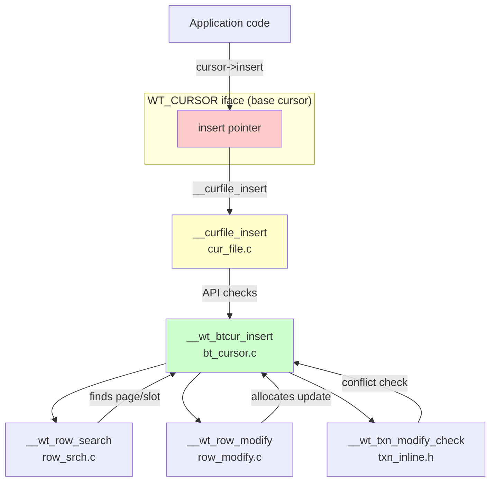

# Where Does `insert` Live? Cursor Architecture in WiredTiger

## The Question

> Where does the `insert` function live - is it part of btree cursor?

## Answer: It's a Function Pointer in the Cursor Struct

In C (WiredTiger), there's no "methods" like in object-oriented languages. Instead, cursor operations are **function pointers** stored in the cursor struct.

## Cursor Structure Layout

```c
// From cursor.h:116
struct __wt_cursor_btree {
    WT_CURSOR iface;       // Base cursor with function pointers

    // Btree-specific state:
    WT_DATA_HANDLE *dhandle;
    WT_REF *ref;           // Current page
    uint32_t slot;         // Position in page
    int compare;           // Search result
    WT_ITEM *row_key;      // Built key
    ...
};
```

The `WT_CURSOR iface` contains all the function pointers:

```c
// From wiredtiger.h.in:212
struct __wt_cursor {
    WT_SESSION *session;
    const char *uri;
    const char *key_format;
    const char *value_format;

    // Function pointers:
    int __F(get_key)(WT_CURSOR *cursor, ...);
    int __F(get_value)(WT_CURSOR *cursor, ...);
    int __F(insert)(WT_CURSOR *cursor);        // ← INSERT POINTER
    int __F(update)(WT_CURSOR *cursor);
    int __F(remove)(WT_CURSOR *cursor);
    int __F(search)(WT_CURSOR *cursor);
    int __F(next)(WT_CURSOR *cursor);
    int __F(prev)(WT_CURSOR *cursor);
    ...
};
```

## How Function Pointers Are Set Up

When you call `open_cursor("file:...")`, WiredTiger:

1. **Allocates** a `WT_CURSOR_BTREE` struct
2. **Sets up** function pointers using static initialization
3. **Connects** them to the actual implementation functions

From [cur_file.c:1026-1049](/Users/gabrielelanaro/workspace/wiredtiger/src/cursor/cur_file.c#L1026-L1049):

```c
static int
__curfile_create(WT_SESSION_IMPL *session, ...) {
    // Static initialization: defines which functions to use
    WT_CURSOR_STATIC_INIT(iface,
        __wt_cursor_get_key,        // get-key
        __wt_cursor_get_value,      // get-value
        __curfile_compare,          // compare
        __curfile_equals,           // equals
        __curfile_next,             // next
        __curfile_prev,             // prev
        __curfile_reset,            // reset
        __curfile_search,           // search
        __wti_curfile_search_near,  // search-near
        __curfile_insert,           // insert ← POINTS HERE
        __curfile_update,           // update
        __curfile_remove,           // remove
        ...
    );

    // Allocate cursor struct
    WT_RET(__wt_calloc(session, 1, sizeof(WT_CURSOR_BTREE), &cbt));
    cursor = &cbt->iface;

    // Copy function pointers to cursor
    *cursor = iface;  // This copies all function pointers!

    cursor->session = (WT_SESSION *)session;
    cursor->key_format = btree->key_format;
    ...
}
```

## The Complete Call Chain



## Code: __curfile_insert (Wrapper)

From [cur_file.c:215](/Users/gabrielelanaro/workspace/wiredtiger/src/cursor/cur_file.c):

```c
/*
 * __curfile_insert --
 *     WT_CURSOR->insert method for the btree cursor type.
 */
static int
__curfile_insert(WT_CURSOR *cursor)
{
    WT_CURSOR_BTREE *cbt;
    WT_DECL_RET;
    WT_SESSION_IMPL *session;

    cbt = (WT_CURSOR_BTREE *)cursor;
    CURSOR_API_CALL(cursor, session, ret, insert, cbt->dhandle);

    /*
     * We can't insert with a bit in the transaction that's failed, that would set the bit
     * in the on-disk page.
     */
    WT_ERR(__wt_txn_view_get_session(session));
    ret = __wt_btcur_insert(cbt);  // ← Calls the actual insert!

err:
    API_END_RET_STAT(session, ret, cursor_insert);
}
```

## Code: __wt_btcur_insert (Implementation)

From [bt_cursor.c:1004](/Users/gabrielelanaro/workspace/wiredtiger/src/btree/bt_cursor.c):

```c
/*
 * __wt_btcur_insert --
 *     Insert a record into the tree.
 */
int
__wt_btcur_insert(WT_CURSOR_BTREE *cbt)
{
    WT_BTREE *btree;
    WT_DECL_RET;
    WT_SESSION_IMPL *session;

    session = CUR2S(cbt);
    btree = CUR2BT(session);

    // 1. Find position
    ret = __cursor_func_init(cbt, CURSOR_OP_INSERT, NULL);
    WT_ERR(ret);
    ret = __wt_row_search(session, cbt, ...);

    // 2. Check for conflicts
    WT_ERR(__wt_txn_modify_check(session, cbt, upd, ...));

    // 3. Modify the tree
    WT_ERR(__wt_row_modify(session, cbt, ...));

    ...
}
```

## Key Insight: C vs OOP

| OOP Language (e.g., Python) | C (WiredTiger) |
|----------------------------|----------------|
| `class BTreeCursor:` | `struct WT_CURSOR_BTREE` |
| `def insert(self, ...):` | Function pointer `iface.insert` |
| Method is part of class | Function is separate, pointer stored in struct |
| `cursor.insert()` calls the method | `cursor->insert()` calls via function pointer |

```python
# OOP style (for comparison)
class BTreeCursor:
    def insert(self, key, value):
        # This method is "part of" the class
        self.btree.insert(key, value)
```

```c
// C style (WiredTiger)
struct WT_CURSOR_BTREE {
    WT_CURSOR iface;  // Contains function pointer
    // State data...
};

// Function is separate!
int __wt_btcur_insert(WT_CURSOR_BTREE *cbt) {
    // Implementation
}

// Connected during initialization:
// cursor->iface.insert = __curfile_insert;
// __curfile_insert internally calls __wt_btcur_insert
```

## Why Two Layers?

WiredTiger has **two layers** of indirection:

1. **`__curfile_insert`**: API layer
   - Handles error checking
   - Does transaction management
   - Manages cursor state
   - Returns proper error codes

2. **`__wt_btcur_insert`**: BTree implementation
   - Actual tree logic
   - Page manipulation
   - Update chain management

This separation allows:
- Different cursor types (file, table, backup, etc.)
- Shared API handling
- Swappable implementations

## Summary

**"Where does insert live?"**

- **As a function pointer**: In `WT_CURSOR iface.insert`
- **As a function**: `__curfile_insert` (wrapper) → `__wt_btcur_insert` (implementation)
- **Physically located**:
  - Wrapper: `/Users/gabrielelanaro/workspace/wiredtiger/src/cursor/cur_file.c`
  - Implementation: `/Users/gabrielelanaro/workspace/wiredtiger/src/btree/bt_cursor.c`
- **Connected during**: `open_cursor()` → `__curfile_create()` via static initialization

The cursor struct holds the **state** (page, slot, position), while **function pointers** connect to the algorithms that operate on that state.
