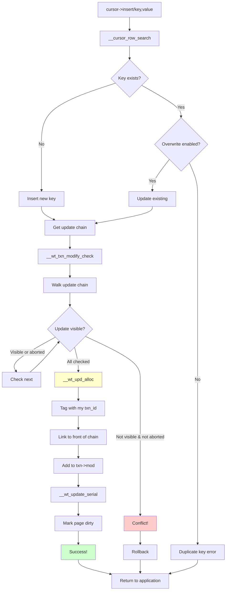

# Successful Insert: No Conflict Path

## Overview

When there's no write conflict, WiredTiger:
1. Creates a new `WT_UPDATE` structure
2. Tags it with your transaction ID
3. Links it to the front of the update chain
4. Logs it to the transaction's operation list
5. Marks the page as dirty

## The Successful Insert Flow



## Step-by-Step: No Conflict Example

### Scenario Setup

```
My transaction: txn_id=100
My snapshot: snap_min=50, snap_max=150, snapshot={80, 120}

I want to update key="user:123"

Existing update chain:
┌────────────────────────────────────────┐
│ [txn_id=130, value="Zoe"]  ← Too new (not in snapshot) │
│ [txn_id=70, value="Bob"]   ← In snapshot, but visible!  │
│ [txn_id=40, value="Alice"]  ← Old enough to see        │
└────────────────────────────────────────┘
```

### Step 1: Find Position

```c
// Found the key in the B+tree
cbt->ref = page_ref;
cbt->slot = 12;           // Key "user:123" is at slot 12
cbt->compare = 0;         // Exact match found (will update)
```

### Step 2: Check for Conflicts

```c
// Walk the update chain from newest to oldest
for (WT_UPDATE *upd = page->modify->update[12];
     upd != NULL && !__wt_txn_upd_visible(session, upd);
     upd = upd->next) {

    // Check txn_id=130
    if (!__wt_txn_visible(session, 130)) {
        // 130 is NOT visible to me (130 >= snap_max)
        // But 130 hasn't committed yet (active transaction)
        // Skip it, keep checking older updates
        continue;
    }
}

// All updates were either:
// - Visible (txn_id=70, 40) → OK to overwrite!
// - Too new (txn_id=130) → OK to overwrite!
// Result: NO CONFLICT, proceed with insert
```

### Step 3: Allocate Update Structure

```c
// Create a new WT_UPDATE
WT_UPDATE *upd;
__wt_upd_alloc(session, value={name: "Charlie"}, WT_UPDATE_STANDARD, &upd);

// Tag it with MY transaction
upd->txnid = session->txn->id;           // = 100
upd->start_ts = session->txn->commit_ts;  // = 1234567890
upd->durable_ts = 0;                       // Not durable yet
upd->type = WT_UPDATE_STANDARD;
upd->data = copy_of_value;
upd->size = value.size;
upd->next = NULL;
```

### Step 4: Link to Update Chain

```c
// Get the current head of the update chain
WT_UPDATE **upd_entry = &page->modify->mod_row_update[12];

// BEFORE: [130="Zoe"] → [70="Bob"] → [40="Alice"]
// We point to current head
upd->next = *upd_entry;

// Replace head with our new update
*upd_entry = upd;

// AFTER: [100="Charlie"] → [130="Zoe"] → [70="Bob"] → [40="Alice"]
```

### Visual: Update Chain Transformation

```
BEFORE (existing chain):
┌──────────────────────────────────────────────────┐
│ page->modify->update[12]                        │
│                                                  │
│   ┌─────────────────────────────────────────┐    │
│   │ [txn=130, ts=150, "Zoe"]              │    │
│   │     ↓ next                                │    │
│   │ [txn=70, ts=80, "Bob"]               │    │
│   │     ↓ next                                │    │
│   │ [txn=40, ts=50, "Alice"]             │    │
│   └─────────────────────────────────────────┘    │
└──────────────────────────────────────────────────┘

AFTER (our insert):
┌──────────────────────────────────────────────────┐
│ page->modify->update[12]                        │
│                                                  │
│   ┌─────────────────────────────────────────┐    │
│   │ [txn=100, ts=100, "Charlie"] ← OUR UPDATE!│    │
│   │     ↓ next                                │    │
│   │ [txn=130, ts=150, "Zoe"]              │    │
│   │     ↓ next                                │    │
│   │ [txn=70, ts=80, "Bob"]               │    │
│   │     ↓ next                                │
│   │ [txn=40, ts=50, "Alice"]             │    │
│   └─────────────────────────────────────────┘    │
└──────────────────────────────────────────────────┘

Key point: Newest updates go to the FRONT (left side)
```

### Step 5: Add to Transaction Log

```c
// Create operation record for WAL
WT_TXN_OP *op = &txn->mod[txn->mod_count++];
op->type = WT_TXN_OP_BASIC_ROW;
op->btree = btree;
op->op_row.key = copy_of_key;
op->op_row.upd = upd;  // Point to our update

// This will be logged to WAL during commit
```

### Step 6: Mark Page Dirty

```c
// Mark page as modified
page->modify->page_state = WT_PAGE_DIRTY;

// Track dirty bytes for eviction
txn->mod->bytes_dirty += upd->size;
```

## What Each Transaction Sees

### After Transaction 100 Commits (ts=100):

```
Committed state: [100="Charlie"] is now the committed value
Other chains still have uncommitted data
```

### Transaction 130 (still running) reads key="user:123":

```
Walks update chain:
[txn=100, ts=100, "Charlie"] → 100 >= my snap_max? INVISIBLE
[txn=130, ts=150, "Zoe"]     → 130 == my id? VISIBLE (see own writes!)
[txn=70, ts=80, "Bob"]       → Skip
[txn=40, ts=50, "Alice"]      → Skip

Result: Returns "Zoe" (sees its own uncommitted write)
```

### Transaction 90 (starts after 100 commits, snapshot={100}) reads:

```
Walks update chain:
[txn=100, ts=100, "Charlie"] → 100 < my snap_min? VISIBLE!
[txn=130, ts=150, "Zoe"]     → Skip
[txn=70, ts=80, "Bob"]       → Skip

Result: Returns "Charlie" (sees committed value)
```

## Python Implementation

```python
@dataclass
class WT_UPDATE:
    txnid: int
    start_ts: int
    data: bytes
    next: Optional['WT_UPDATE'] = None

class BTreePage:
    def __init__(self):
        self.modify = PageModify()

    def insert(self, slot: int, update: WT_UPDATE):
        """Insert an update at the given slot."""
        chain_head = self.modify.updates[slot]

        # Link to front (newest first)
        update.next = chain_head
        self.modify.updates[slot] = update

        # Mark page dirty
        self.modify.page_state = DIRTY

class Transaction:
    def insert(self, cursor, key: str, value: dict):
        """Insert a key-value pair."""
        # 1. Find position
        page, slot = self.btree.find_position(key)

        # 2. Check for conflicts
        existing = page.modify.updates[slot]
        if not self._check_conflicts(existing):
            raise WriteConflictError("Conflict detected")

        # 3. Create update
        update = WT_UPDATE(
            txnid=self.id,
            start_ts=self.commit_timestamp,
            data=serialize(value)
        )

        # 4. Link to update chain
        page.insert(slot, update)

        # 5. Log operation
        self.mod.append(Operation(
            type="row_put",
            fileid=self.btree.fileid,
            key=key,
            update=update
        ))

        return True

    def _check_conflicts(self, existing: WT_UPDATE) -> bool:
        """Check if we can modify based on our snapshot."""
        upd = existing

        while upd is not None:
            if upd.txnid == WT_TXN_ABORTED:
                upd = upd.next
                continue

            if not self._is_visible(upd.txnid):
                # Not visible to us
                if upd.txnid != WT_TXN_ABORTED:
                    # Someone else's uncommitted data!
                    return False  # CONFLICT
                upd = upd.next
                continue

            # Visible update - check for write-write conflict
            # (In snapshot isolation, any visible update conflicts)
            return False

        return True

    def _is_visible(self, txn_id: int) -> bool:
        """Check if a transaction is visible to our snapshot."""
        if txn_id < self.snapshot.snap_min:
            return True
        if txn_id >= self.snapshot.snap_max:
            return False
        return txn_id not in self.snapshot.snapshot
```

## Key Outcomes

| Scenario | Result |
|----------|--------|
| **No existing data** | Create new update chain |
| **Existing visible data** | Prepend our update to chain (overwrite) |
| **Existing invisible data** | Skip invisible updates, check deeper |
| **Conflict detected** | Abort or retry |
| **Success** | Update linked, page marked dirty, logged to WAL |

## The Update Chain Rule

**Newest updates always go to the FRONT:**

```
After insert(key, value):
[MY_UPDATE] → [old_update_2] → [old_update_1] → [disk_value]

Reading: Walk from front to back
  1. Check MY_UPDATE (my transaction) → See own writes
  2. Check old_update_2 → Check visibility
  3. Check old_update_1 → Check visibility
  4. Use disk_value if nothing visible
```

This is how WiredTiger implements **MVCC with update chains**!
