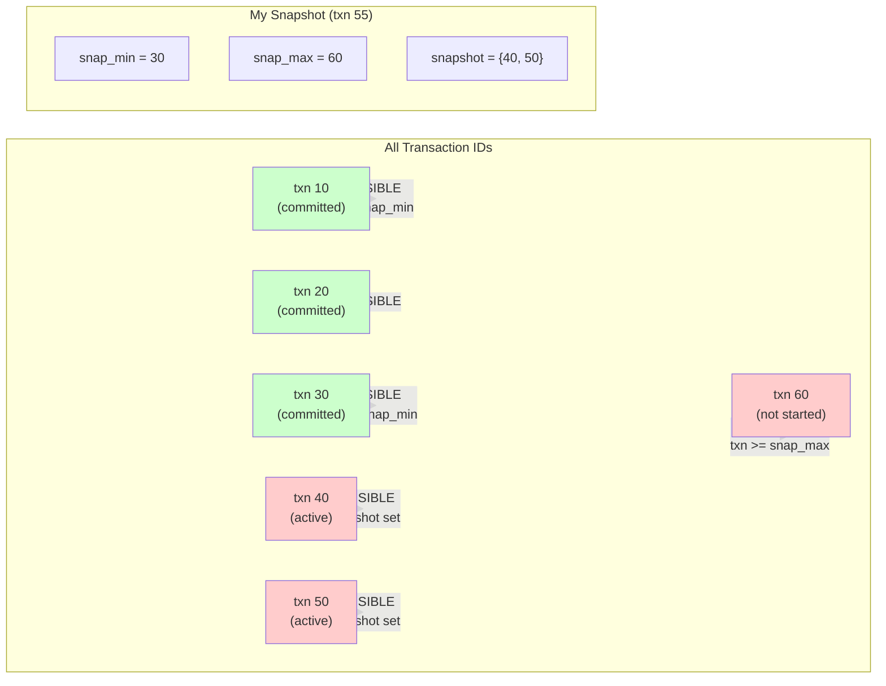
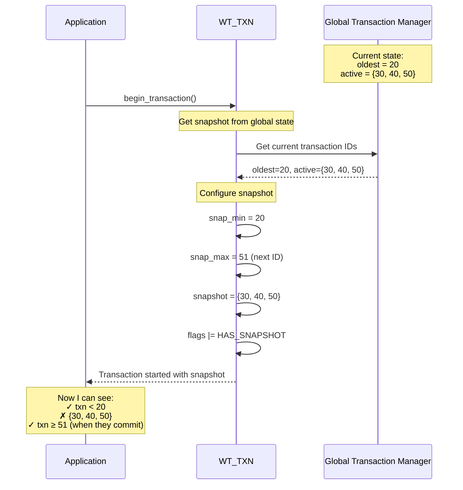

# Snapshot Data in WiredTiger

## What is a Snapshot?

A **snapshot** is your transaction's "view of the world" - it determines which other transactions' changes you can see.

Think of it as taking a picture of all the transaction IDs that were active when you started. You only see changes from transactions that:
1. **Committed before you started** (older than `snap_min`)
2. **OR are in your snapshot set** (transactions active when you started)

## The Snapshot Structure

```c
struct __wt_txn_snapshot {
    /*
     * txn_ids >= snap_max are invisible,
     * txn_ids < snap_min are visible,
     * everything else is visible unless it is in the snapshot.
     */
    uint64_t snap_max, snap_min;
    uint64_t *snapshot;
    uint32_t snapshot_count;
};
```

## Visual Representation



## How Snapshots Work

### The Three Zones

```
Transaction IDs:  10    20    30    40    50    60    70    80
                   |-----|-----|-----|-----|-----|-----|-----|
                   └─────snap_min=30─────snap_max=70──────┘

Zone 1: txn < snap_min          →  ALWAYS VISIBLE
Zone 2: snap_min ≤ txn < snap_max →  Check snapshot set
Zone 3: txn ≥ snap_max          →  ALWAYS INVISIBLE
```

### Example

```python
# I am transaction 55, starting now
my_txn_id = 55

# Current state of the world:
# - Transactions 10, 20, 30: committed long ago
# - Transactions 40, 50: currently running
# - Transactions 60, 70, 80: haven't started yet

# My snapshot:
snap_min = 30              # Everything < 30 is visible
snap_max = 60              # Everything ≥ 60 is invisible
snapshot = {40, 50}        # Transactions 40, 50 are also invisible

# Visibility checks:
update_from_txn_10.visible?  YES  # 10 < 30
update_from_txn_20.visible?  YES  # 20 < 30
update_from_txn_30.visible?  YES  # 30 == 30
update_from_txn_40.visible?  NO   # 40 in {40, 50}
update_from_txn_50.visible?  NO   # 50 in {40, 50}
update_from_txn_60.visible?  NO   # 60 >= 60
update_from_txn_70.visible?  NO   # 70 >= 60
```

## When Are Snapshots Created?



## Python Implementation

```python
@dataclass
class TxnSnapshot:
    """
    Snapshot data: determines which transactions are visible.

    Key rule:
    - txn_ids < snap_min are VISIBLE (committed before snapshot)
    - txn_ids ≥ snap_max are INVISIBLE (not yet started)
    - everything else: check the snapshot set (active transactions)
    """
    snap_min: int = 0          # Transactions older than this are visible
    snap_max: int = 0          # Transactions newer than this are invisible
    snapshot: Set[int] = field(default_factory=set)  # Active transaction IDs
    snapshot_count: int = 0     # Length of snapshot set

    def in_snapshot(self, txn_id: int) -> bool:
        """
        Check if a transaction ID is visible to this snapshot.

        Returns True if visible, False if invisible.
        """
        # Zone 1: Old transactions are always visible
        if txn_id < self.snap_min:
            return True

        # Zone 3: New transactions are always invisible
        if txn_id >= self.snap_max:
            return False

        # Zone 2: Check the snapshot set (active transactions)
        return txn_id not in self.snapshot

# ===== Usage Example =====

# My transaction starts
my_snapshot = TxnSnapshot(
    snap_min=30,
    snap_max=60,
    snapshot={40, 50}  # Transactions active when I started
)

# Check visibility of various updates
updates = [
    (10, "data from txn 10"),   # Old - visible
    (30, "data from txn 30"),   # At boundary - visible
    (40, "data from txn 40"),   # In snapshot - invisible
    (50, "data from txn 50"),   # In snapshot - invisible
    (60, "data from txn 60"),   # At boundary - invisible
    (70, "data from txn 70"),   # New - invisible
]

for txn_id, data in updates:
    if my_snapshot.in_snapshot(txn_id):
        print(f"txn {txn_id}: VISIBLE - {data}")
    else:
        print(f"txn {txn_id}: INVISIBLE - {data}")
```

Output:
```
txn 10: VISIBLE - data from txn 10
txn 30: VISIBLE - data from txn 30
txn 40: INVISIBLE - data from txn 40
txn 50: INVISIBLE - data from txn 50
txn 60: INVISIBLE - data from txn 60
txn 70: INVISIBLE - data from txn 70
```

## Why Snapshots Matter

### Problem: Concurrent Updates

```
Timeline:
t0: Transaction A starts
t1: Transaction A reads x=5
t2: Transaction B starts
t3: Transaction B updates x=10, commits
t4: Transaction A reads x again
    What should A see? x=5 or x=10?
```

### Solution: Snapshots

```
With snapshots:

t0: Transaction A starts
    A.snapshot = {snap_min=0, snap_max=100, snapshot={}}

t1: Transaction A reads x=5
    A sees x=5 (from before B)

t2: Transaction B starts
    B.snapshot = {snap_min=0, snap_max=101, snapshot={A}}

t3: Transaction B updates x=10, commits
    B's update marked with txn_id=B
    A cannot see it! (B in A's snapshot set)

t4: Transaction A reads x again
    A checks: B.in_snapshot(A.snapshot) → FALSE
    A still sees x=5

Result: Repeatable read! A sees consistent view.
```

## Real WiredTiger Code

```c
// From txn_inline.h:1269
static inline bool
__txn_visible_id(WT_SESSION_IMPL *session, uint64_t id)
{
    WT_TXN *txn = session->txn;

    // Old transactions: always visible
    if (id < txn->snapshot_data.snap_min)
        return true;

    // New transactions: not visible
    if (id >= txn->snapshot_data.snap_max)
        return false;

    // Middle: check snapshot set
    return __wt_txn_visible_id_snapshot(
        id,
        txn->snapshot_data.snap_min,
        txn->snapshot_data.snap_max,
        txn->snapshot_data.snapshot,
        txn->snapshot_data.snapshot_count
    );
}
```

## Snapshot Creation Algorithm

```python
def create_snapshot(global_state):
    """
    Create a snapshot from the global transaction state.

    global_state contains:
    - oldest: oldest active transaction ID
    - current: next transaction ID to assign
    - active: set of currently running transaction IDs
    """
    return TxnSnapshot(
        snap_min=global_state.oldest,          # Everything older is visible
        snap_max=global_state.current + 1,       # Everything newer is invisible
        snapshot=set(global_state.active)       # Active ones are invisible
    )
```

## Key Insights

1. **Snapshots are taken at transaction start** - captures which transactions are running
2. **Three zones of visibility**:
   - `< snap_min`: Always visible (committed long ago)
   - `≥ snap_max`: Always invisible (haven't started yet)
   - In between: Check snapshot set (were active when I started)
3. **Enforces repeatable reads** - you won't see new commits during your transaction
4. **Enforces isolation** - you don't see in-progress transactions' changes

## Comparison: Database Isolation Levels

| Isolation Level | Snapshot Behavior |
|-----------------|-------------------|
| **Read Uncommitted** | No snapshot (see everything, even uncommitted) |
| **Read Committed** | Snapshot changes on each statement |
| **Snapshot (Repeatable Read)** | Fixed snapshot for entire transaction ← WiredTiger default |
| **Serializable** | Snapshot + predicate locking |

WiredTiger uses **Snapshot Isolation** by default!
