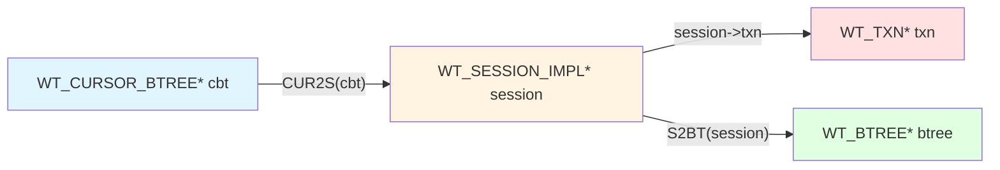
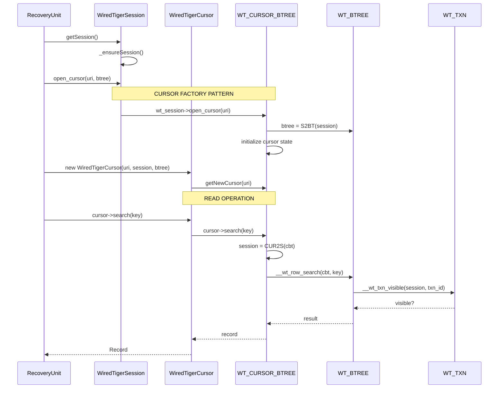
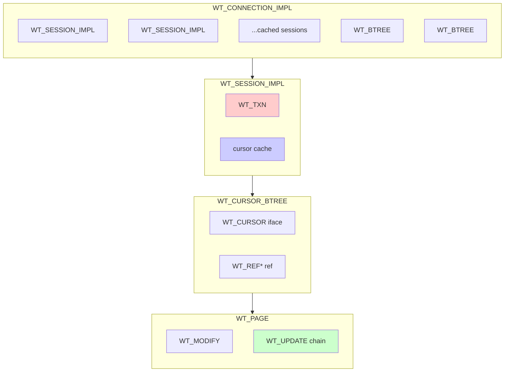
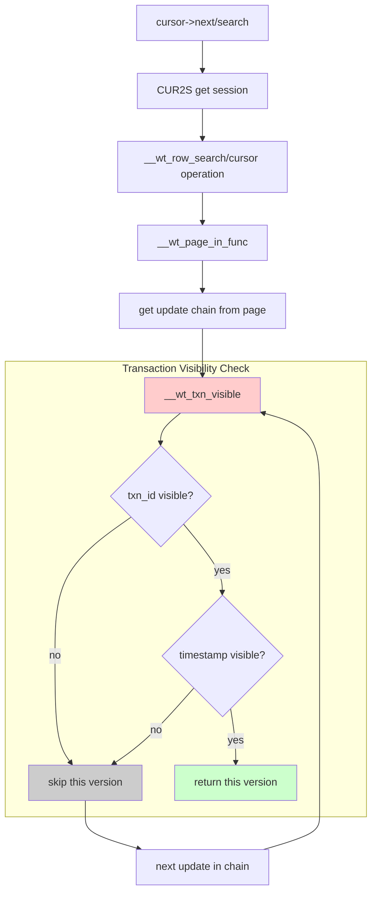

# WiredTiger Architecture Diagram

## Class Relationship Overview

```mermaid
classDiagram
    WT_CONNECTION_IMPL "-->" "1..*" WT_SESSION_IMPL : creates
    WT_SESSION_IMPL "1" --> "1" WT_TXN : contains
    WT_SESSION_IMPL "1" --> "1..*" WT_CURSOR : creates

    WT_CURSOR "*" --> "1" WT_SESSION_IMPL : session (CUR2S)
    WT_CURSOR_BTREE --|> WT_CURSOR
    WT_CURSOR_BTREE "1" --> "1" WT_BTREE : operates on

    WT_BTREE "*" --> "1" WT_CONNECTION_IMPL : owned by
    WT_BTREE "1" --> "1..*" WT_REF : root/reference
    WT_REF "*" --> "1" WT_PAGE : points to

    WT_PAGE "1" --> "0..*" WT_MODIFY : modifications
    WT_PAGE "1" --> "0..*" WT_UPDATE : update chain

    class WT_CONNECTION_IMPL {
        +WT_SESSION_IMPL* default_session
        +WT_BTREE* btrees
        open_session()
        open_cursor()
    }

    class WT_SESSION_IMPL {
        +WT_TXN* txn
        +WT_CONNECTION_IMPL* connection
        +WT_CURSOR* cursor_cache
        begin_transaction()
        commit_transaction()
        open_cursor(uri, config)
    }

    class WT_TXN {
        +uint64_t id
        +WT_TXN_ISOLATION isolation
        +uint64_t snapshot_min
        +wt_timestamp_t read_timestamp
        +bool running
        visible(txn_id, timestamp)
    }

    class WT_CURSOR {
        +WT_SESSION_IMPL* session
        +WT_ITEM key
        +WT_ITEM value
        <<interface>>
    }

    class WT_CURSOR_BTREE {
        +WT_CURSOR iface
        +WT_REF* ref
        +WT_BTREE* btree
        +int compare
        search(key)
        next()
        reset()
    }

    class WT_BTREE {
        +WT_SESSION_IMPL* session
        +WT_REF* root
        +uint32_t pagemax
        key_format
        value_format
    }

    class WT_REF {
        +WT_PAGE* page
        +wt_timestamp_t rec_max_txn
        +uint8_t state
        +addr_t addr
    }

    class WT_PAGE {
        +WT_PAGE_HEADER* header
        +void* dsk
        +WT_MODIFY* modify
        +u_int type
    }

    class WT_MODIFY {
        +WT_UPDATE* first_update
        +WT_UPDATE* last_update
        +uint32_t write_gen
    }

    class WT_UPDATE {
        +WT_TXN* txn
        +wt_timestamp_t start_ts
        +wt_timestamp_t durable_ts
        +WT_UPDATE* next
        +data/value
    }
```

## Key Navigation Macros



## Cursor Lifecycle Flow



## Memory Layout



## Visibility Check Path


