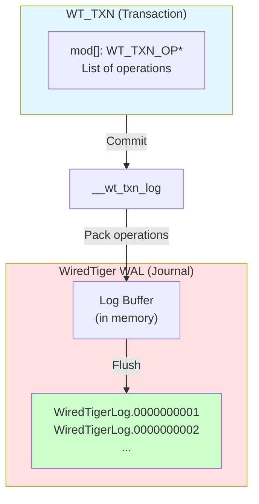
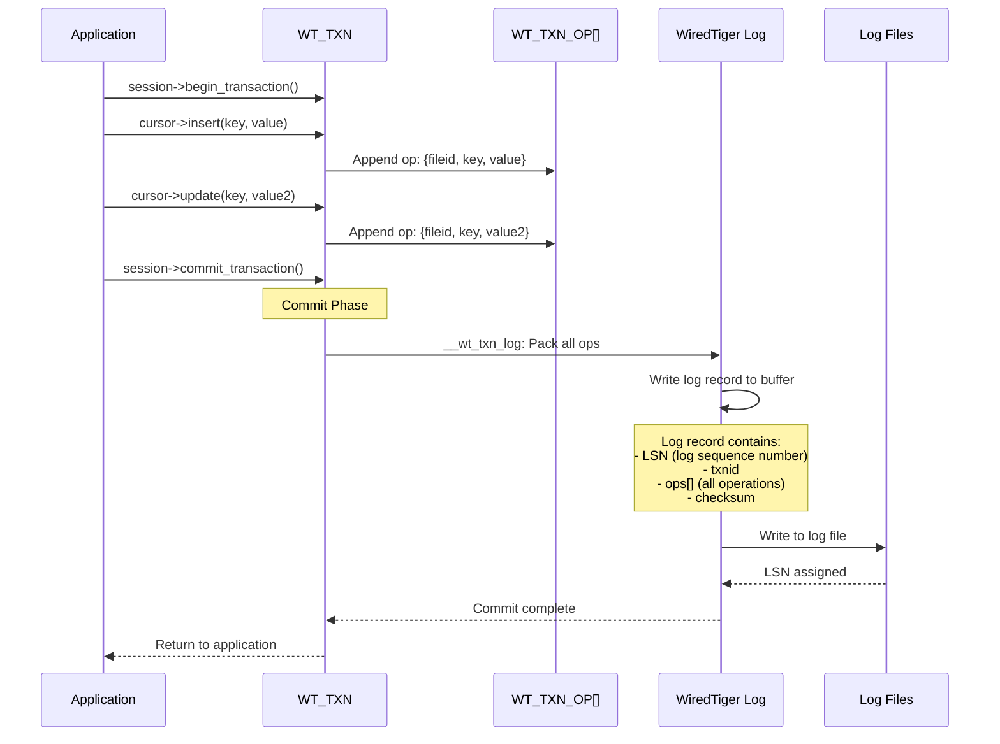
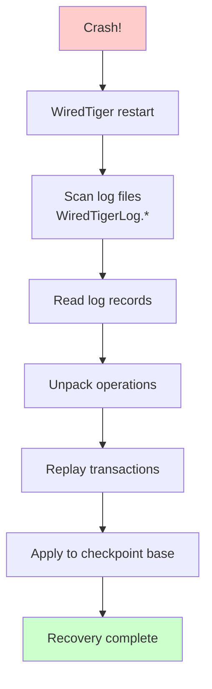
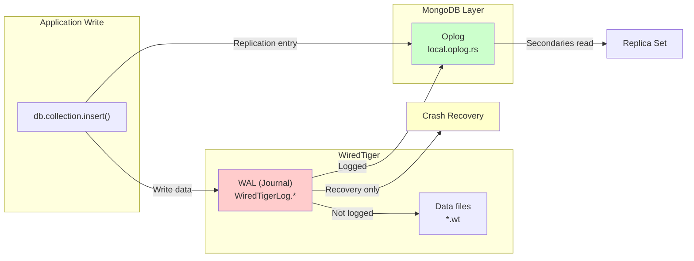
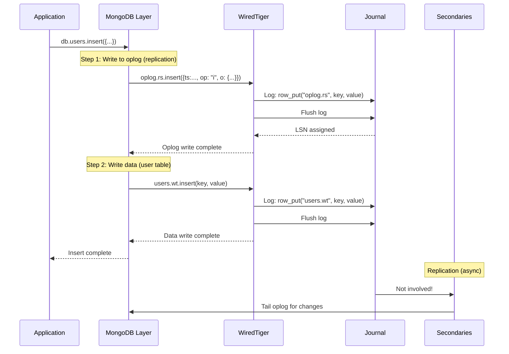

# WiredTiger WAL (Write-Ahead Log)

## Overview

WiredTiger implements a Write-Ahead Log (WAL) for durability and crash recovery. In MongoDB context, this is called the **"journal"**.

## WAL Architecture



## Transaction Operation List

Each transaction maintains a list of operations (`WT_TXN_OP`):

```c
struct __wt_txn_op {
    WT_BTREE *btree;       // Which tree
    WT_TXN_TYPE type;      // Operation type
    union {
        struct {
            WT_UPDATE *upd;  // The update
            WT_ITEM key;     // The key
        } op_row;           // For row-store
        struct {
            WT_UPDATE *upd;
            uint64_t recno;  // Record number
        } op_col;           // For column-store
    } u;
};
```

## The WAL Commit Path



## Log Record Structure

From MongoDB's WiredTiger documentation:

```
+------------+---------------------------+
| Log Header |                         |
+------------+                         |
| LSN        | 2/57984 (file 2, offset) |
| hdr_flags  | Compression flags       |
| rec_len    | Record length           |
| type       | commit, checkpoint, etc |
| txnid      | Transaction ID          |
+------------+---------------------------+
| OPS        |                         |
| +----------+                        |
| | op1      | row_put(fileid=5, key, value) |
| +----------+                        |
| | op2      | row_put(fileid=5, key2, value2) |
| +----------+                        |
| | op3      | row_remove(fileid=5, key3) |
| +----------+                        |
+------------+---------------------------+
| Checksum   |                         |
+------------+---------------------------+
```

## Operation Types

```c
typedef enum {
    WT_TXN_OP_NONE = 0,
    WT_TXN_OP_BASIC_COL,     // Column-store operation
    WT_TXN_OP_BASIC_ROW,     // Row-store operation
    WT_TXN_OP_INMEM_COL,     // In-memory column-store
    WT_TXN_OP_INMEM_ROW,     // In-memory row-store
    WT_TXN_OP_REF_DELETE,    // Reference delete
    WT_TXN_OP_TRUNCATE_COL,  // Column-store truncate
    WT_TXN_OP_TRUNCATE_ROW    // Row-store truncate
} WT_TXN_TYPE;
```

## Key Differences: MongoDB Oplog vs WiredTiger WAL

| Aspect | MongoDB Oplog | WiredTiger WAL (Journal) |
|--------|---------------|--------------------------|
| **Purpose** | Replication (logical) | Durability (physical) |
| **Content** | Complete documents | Operations (put/remove/modify) |
| **Format** | BSON (BSONObject) | Binary packed format |
| **Location** | `local.oplog.rs` | `WiredTigerLog.*` |
| **Writes** | Only oplog writes | All logged tables |
| **Visibility** | Secondaries read it | Only for recovery |
| **Read by** | Replication layer | Recovery code only |

## What Tables Does MongoDB Log?

MongoDB only logs certain tables to the WAL:

```c
// Logged (for durability):
"local.oplog.rs"           → YES (critical for replication)

// Not logged (rebuilt on recovery):
"admin.system.version"     → NO
"config.collections"        → NO
"index tables"              → NO (indexes rebuilt from data)
"most user tables"          → NO
```

## Recovery Process



## File System Layout

```
/data/db/
├── WiredTiger                  (Metadata)
├── WiredTigerLAS.wt            (Lookaside store)
├── WiredTiger.lock             (Lock file)
├── WiredTiger.turtle           (Config)
├── journal/
│   ├── WiredTigerLog.0000000001   ← WAL files here
│   ├── WiredTigerLog.0000000002
│   ├── WiredTigerLog.0000000003
│   └── ...
├── collection-0--123456789.wt     (Data files)
├── index-1--234567890.wt          (Index files)
├── sizeStorer.wt
└── _mdb_catalog.wt
```

## WAL vs Oplog: Complete Picture



## Key Insight: WAL is NOT the Oplog!

The oplog and WAL serve **completely different purposes**:

### WiredTiger WAL (Journal)
```python
# Written during transaction commit
wt_txn_commit():
    # For durability and recovery
    log_record = pack_ops(transaction.ops)
    write_to_log(log_record)     # Physical durability
    flush_to_disk(log_record)

    # Only used for:
    # - Crash recovery
    # - Rollback
    # NOT used for replication!
```

### MongoDB Oplog
```python
# Written by application layer
insert_into_oplog():
    # For replication
    oplog_entry = {
        "ts": timestamp,        # OpTime
        "ns": "db.collection",  # Namespace
        "h": number,            # Hash
        "v": 2,                 # Version
        "op": "i",              # Operation
        "o": {"_id": ..., ...}   # Full document (BSON)
    }
    db.oplog.rs.insert(oplog_entry)  # Uses WAL internally!

    # Secondaries tail this for replication
    # Not used for crash recovery!
```

## How They Work Together



## References

### WiredTiger Source
- `/Users/gabrielelanaro/workspace/wiredtiger/src/log/log.c` - Core log implementation
- `/Users/gabrielelanaro/workspace/wiredtiger/src/txn/txn_log.c` - Transaction logging
- `/Users/gabrielelanaro/workspace/wiredtiger/src/txn/txn_recover.c` - Recovery

### MongoDB Source
- `/Users/gabrielelanaro/workspace/mongodb/src/mongo/db/storage/wiredtiger/README.md` - Detailed WAL documentation
- `/Users/gabrielelanaro/workspace/mongodb/src/mongo/db/storage/wiredtiger/wiredtiger_recovery_unit.cpp` - Transaction commit

### Key Files
| File | Purpose |
|------|---------|
| `WiredTigerLog.*` | WAL/journal files |
| `WiredTiger` | Connection metadata |
| `*.wt` | Data files (BTree tables) |
