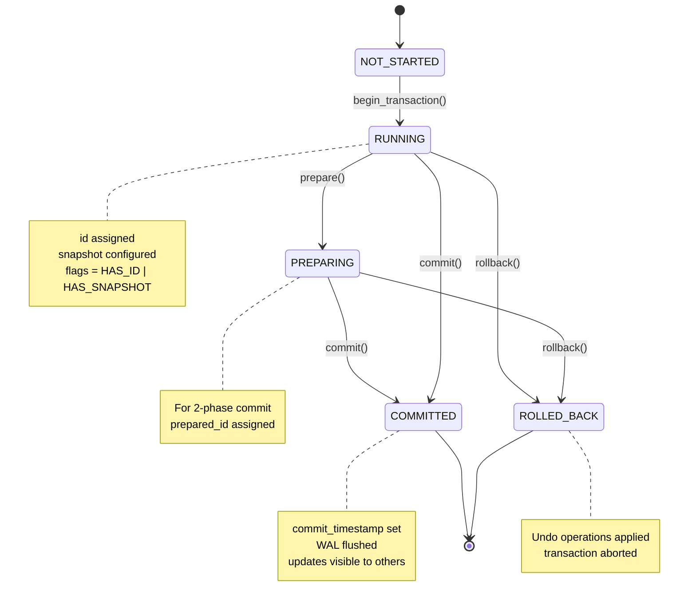

# WT_TXN in Python

## Overview

When `session->begin_transaction()` is called, WiredTiger creates a `WT_TXN` structure to track the transaction's state. Here's how that maps to Python:

## Complete Python Representation

```python
from dataclasses import dataclass, field
from typing import List, Set, Optional
from enum import IntEnum

class IsolationLevel(IntEnum):
    """Transaction isolation levels."""
    READ_UNCOMMITTED = 0
    READ_COMMITTED = 1
    SNAPSHOT = 2
    # Note: WiredTiger uses SNAPSHOT isolation (MVCC) by default

class TxnFlag(IntEnum):
    """Transaction state flags."""
    AUTOCOMMIT = 0x000001
    ERROR = 0x000002
    HAS_ID = 0x000004
    HAS_PREPARED_ID = 0x000008
    HAS_SNAPSHOT = 0x000010
    HAS_TS_COMMIT = 0x000020
    HAS_TS_DURABLE = 0x000040
    HAS_TS_PREPARE = 0x000080
    HAS_TS_ROLLBACK = 0x000100
    IGNORE_PREPARE = 0x000200
    IS_CHECKPOINT = 0x000400
    PREPARE = 0x000800
    READONLY = 0x002000
    REFRESH_SNAPSHOT = 0x004000

@dataclass
class TxnSnapshot:
    """
    Snapshot data: determines which transactions are visible.

    Key rule: txn_ids >= snap_max are invisible,
              txn_ids < snap_min are visible,
              everything else depends on snapshot set.
    """
    snap_min: int = 0          # Transactions older than this are visible
    snap_max: int = 0          # Transactions newer than this are invisible
    snapshot: List[int] = field(default_factory=list)  # Transaction IDs between min/max
    snapshot_count: int = 0     # Length of snapshot list

    def in_snapshot(self, txn_id: int) -> bool:
        """Check if a transaction ID is in the snapshot."""
        if txn_id < self.snap_min:
            return True  # Old enough to be visible
        if txn_id >= self.snap_max:
            return False  # Too new to be visible
        return txn_id in self.snapshot  # Check the set

@dataclass
class TxnLog:
    """Logging state for the transaction."""
    logsync: int = 0            # Log sync configuration
    logrec: Optional[bytes] = None  # Scratch buffer for log records

@dataclass
class WTTxn:
    """
    Python representation of WT_TXN (transaction context).

    This is created when session->begin_transaction() is called
    and attached to session->txn.
    """
    # ===== Identity =====
    id: int = 0                 # My transaction ID
    prepared_id: int = 0         # For two-phase commit

    # ===== Isolation =====
    isolation: IsolationLevel = IsolationLevel.SNAPSHOT
    forced_iso: int = 0          # Isolation override

    # ===== Snapshot (which transactions are visible to me) =====
    snapshot_data: TxnSnapshot = field(default_factory=TxnSnapshot)
    backup_snapshot_data: Optional[TxnSnapshot] = None

    # ===== Timestamps =====
    commit_timestamp: int = 0       # When I committed
    durable_timestamp: int = 0      # When I became durable on disk
    first_commit_timestamp: int = 0  # First commit time in multi-statement txn
    prepare_timestamp: int = 0      # When I was prepared (2PC)
    rollback_timestamp: int = 0     # For rollback in preserve mode

    # ===== Checkpoint cursor timestamps =====
    checkpoint_read_timestamp: int = 0
    checkpoint_stable_timestamp: int = 0
    checkpoint_oldest_timestamp: int = 0

    # ===== Operations Log (WAL) =====
    txn_log: TxnLog = field(default_factory=TxnLog)
    mod: List['WT_TXN_OP'] = field(default_factory=list)  # Operations for WAL
    mod_alloc: int = 0            # Allocated operation slots
    mod_count: int = 0            # Number of operations

    # ===== Checkpoint State =====
    ckpt_lsn: int = 0             # Log sequence number of checkpoint
    ckpt_nsnapshot: int = 0       # Number of snapshots
    full_ckpt: bool = False       # Is this a full checkpoint?

    # ===== Timeout =====
    operation_timeout_us: int = 0  # Operation timeout in microseconds

    # ===== Flags =====
    flags: int = 0               # State flags (see TxnFlag)

    # ===== Computed Properties (for convenience) =====
    @property
    def running(self) -> bool:
        """Is this transaction currently running?"""
        # In real WT, checked by flags like HAS_ID
        return self.id != 0 and not (self.flags & TxnFlag.ERROR)

    @property
    def has_id(self) -> bool:
        """Do we have a transaction ID?"""
        return bool(self.flags & TxnFlag.HAS_ID)

    @property
    def has_snapshot(self) -> bool:
        """Do we have a snapshot configured?"""
        return bool(self.flags & TxnFlag.HAS_SNAPSHOT)

    @property
    def has_read_timestamp(self) -> bool:
        """Do we have a read timestamp configured?"""
        # In real WT, this is WT_TXN_SHARED_TS_READ flag in txn_shared
        return self.checkpoint_read_timestamp != 0

    # ===== Methods =====
    def visible(self, update: 'WT_UPDATE') -> bool:
        """
        Check if an update is visible to this transaction.

        This implements the core MVCC visibility check:
        1. Check transaction ID (in snapshot?)
        2. Check timestamp (committed before my read_ts?)
        """
        # Special cases
        if update.txnid == 0xFFFFFFFFFFFFFFFF:  # WT_TXN_NONE
            return True
        if update.txnid == 0xFFFFFFFE:  # WT_TXN_ABORTED
            return False
        if update.txnid == self.id:  # See own writes
            return True
        if self.isolation == IsolationLevel.READ_UNCOMMITTED:
            return True

        # Snapshot check
        if not self.snapshot_data.in_snapshot(update.txnid):
            return False

        # Timestamp check
        if self.has_read_timestamp and update.start_ts != 0:
            return update.start_ts <= self.checkpoint_read_timestamp

        return True

# ===== Supporting Types =====

@dataclass
class WT_TXN_OP:
    """
    Single operation within a transaction (for WAL).

    Each operation that modifies data gets logged to the WAL
    and replayed during recovery.
    """
    btree: object = None        # Which btree (we'd use weak ref in real code)
    type: str = ""              # Operation type
    key: bytes = b""            # Key (for row-store)
    recno: int = 0              # Record number (for column-store)
    update: object = None        # The update (WT_UPDATE)
    flags: int = 0              # Operation flags

@dataclass
class WT_UPDATE:
    """
    Single version in an update chain.
    """
    txnid: int = 0              # Transaction that created this
    start_ts: int = 0           # Commit timestamp
    durable_ts: int = 0         # Durable timestamp
    prepare_ts: int = 0         # Prepare timestamp
    next: Optional['WT_UPDATE'] = None  # Next (older) version
    size: int = 0               # Data length
    type: str = "STANDARD"      # STANDARD, TOMBSTONE, MODIFY
    data: bytes = b""           # Actual data
    prepare_state: int = 0      # Prepare state
```

## Usage Example

```python
# ===== Transaction Lifecycle =====

# 1. Begin transaction (creates WT_TXN)
session.begin_transaction()
# Internally:
session.txn = WTTxn(
    id=100,                           # Assigned transaction ID
    isolation=IsolationLevel.SNAPSHOT,
    flags=TxnFlag.HAS_ID | TxnFlag.HAS_SNAPSHOT
)
session.txn.snapshot_data = TxnSnapshot(
    snap_min=50,           # Old transactions visible
    snap_max=150,          # New transactions invisible
    snapshot=[60, 80, 100], # Middle transactions in snapshot
    snapshot_count=3
)

# 2. Perform operations
cursor.insert(key="user:123", value={"name": "Alice"})
cursor.insert(key="user:456", value={"name": "Bob"})

# Each operation gets added to mod[] for WAL
session.txn.mod.append(WT_TXN_OP(
    type="row_put",
    btree=users_table,
    key=b"user:123",
    update=WT_UPDATE(txnid=100, data=b'{"name": "Alice"}')
))

# 3. Commit transaction
session.commit_transaction()
# Internally:
#   - Pack all mod[] operations into log record
#   - Write to WAL (WiredTigerLog.*)
#   - Wait for flush (based on journal config)
#   - Set commit_timestamp
#   - Mark transaction as committed
```

## Transaction State Diagram



## Key Insights

1. **WT_TXN lives in the session**: `session->txn` points to the transaction
2. **Created on begin_transaction()**: Initializes id, snapshot, flags
3. **Tracks operations for WAL**: `mod[]` list gets logged during commit
4. **Snapshot determines visibility**: `snap_min/max` + `snapshot[]` set
5. **Timestamps track ordering**: commit_ts, durable_ts, prepare_ts, etc.
6. **Flags track state**: HAS_ID, HAS_SNAPSHOT, PREPARE, etc.

## Comparison: C vs Python

| C (WiredTiger) | Python (Conceptual) |
|-----------------|---------------------|
| `session->txn = &txn` | `session.txn = WTTxn()` |
| `txn.id` | `txn.id` |
| `txn.snapshot_data.snap_min` | `txn.snapshot_data.snap_min` |
| `txn->mod[i]` | `txn.mod[i]` |
| `F_ISSET(txn, WT_TXN_HAS_ID)` | `txn.flags & TxnFlag.HAS_ID` |
| `__wt_txn_visible(session, upd)` | `txn.visible(upd)` |
